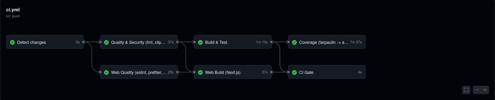

<p align="center">
  
</p>

<h1 align="center">OpsWarden</h1>

<p align="center">
  <a href="https://github.com/RomeoCavazza/opswarden/actions/workflows/ci.yml"></a>
  <a href="https://github.com/RomeoCavazza/opswarden/actions/workflows/release.yml"></a>
  <a href="LICENSE"></a>
  
</p>

<p align="center">
  
  
  
  
  
  
  
  
  
  
</p>

---

- [Scope](#scope) — what ships, in tiers
- [How it works](#how-it-works) — install and run locally
- [Architecture](#architecture) — hexagonal, where things live
- [Roadmap](#roadmap) — phase-by-phase checklist
- [Contributing](#contributing) — workflow and Definition of Done
- [Blueprint](docs/markdown/blueprint.md) and [VIGIL brief](docs/markdown/consignes_VIGIL.md)

## Introduction

**OpsWarden** is a platform where a technical team coordinates, in real time, its
**Incidents** (unplanned problems, triaged and resolved) and its **Releases**
(deployments validated step by step). The two are linked: an active incident can
block an in-progress release.

External events (a failing GitHub CI run, a GitLab webhook) automatically trigger
internal actions through an **Action&rarr;REAction** rule engine, and an **AI SRE**
investigation agent reads the context (logs, commit diff, similar past incidents
via vector search) to propose a root-cause hypothesis and a runbook, posted
straight into the incident timeline.

Positioning: a publishable mini incident.io / Rootly focused on reducing MTTR,
rather than yet another re-skinned real-time chat. All business logic lives on the
server (Rust/Axum, hexagonal architecture); the web and desktop clients display
and relay, with no business logic.

> Status: this repository is at the **scaffolding** stage (S0). Business code is
> not written yet. This page describes the target and how to get there.

## Scope

OpsWarden aims to be a real Incident Management Platform, in the lineage of
**PagerDuty, Opsgenie, incident.io, Rootly and Datadog Incident Management**,
delivered in tiers. Locked architecture decision: a modular hexagonal monolith
(cargo + npm workspaces) for the core, **a single extracted service** (the AI SRE
agent, behind a port), and the cloud/ops layer in **separate repositories** — the
microservices instinct is honored where it pays, without distributed-systems tax
on the graded path.

**Core — required by the brief, graded by the jury**

- Email auth + JWT, `/me`, logout with token invalidation; teams + 3-role RBAC
  (Observer / Responder / Manager) + invitation code + Manager transfer
- Incidents (open &rarr; acknowledged &rarr; escalated &rarr; resolved, severities)
  with a real-time collaborative timeline
- WebSockets (`incident_*`, `presence_update`) + automatic client reconnection
- Action&rarr;REAction automation: GitHub webhook (CI failed) &rarr; incident;
  dynamic `/about.json` + SHA-256 token; encrypted token vault (AES-GCM)
- Tauri desktop client (OS notifications, tray); `docker-compose` (server 8080 /
  client_web 8081 / db / exposed desktop binary); GitHub Actions CI/CD; FR/EN i18n

**Extended — grade-boosting**

- GitHub OAuth2; Releases + automatic blocking by a linked incident; moderation
  (kick / temp ban / perm ban); timeline editing, reactions, private messages
- GitLab as an Action; additional REActions (Slack / HTTP / Email)

**Long-term vision — portfolio (promised, not built yet)**

- **AI SRE**: RAG microservice (FastAPI, `@ask` / `@search`, pgvector, LLM/SLM)
  correlating logs + commit diff + past incidents to propose a root cause + runbook
- **Integrations**: Slack, Jira / Confluence
- **Observability**: OpenTelemetry + Prometheus + Grafana + Loki + Promtail
- **IaC showcase** (repo `opswarden-ops`): Minikube &rarr; k8s &rarr; Terraform &rarr;
  DigitalOcean (DOKS) + Traefik + cAdvisor + Argo/Flux; Redis + async workers
- **Deployment**: Vercel (web) + multi-repo (product monorepo v1, separate ops repos)

> These tiers give the **big picture** to anyone (or any agent) entering the
> project. The grading contract stays the **core**: secure it first, stack the
> rest after. Depth: [blueprint](docs/markdown/blueprint.md).

## How it works

### Installation

```bash
# 1. Clone
git clone https://github.com/RomeoCavazza/opswarden.git    # HTTPS
git clone git@github.com:RomeoCavazza/opswarden.git         # SSH
cd opswarden

# 2. Configure the environment
cp .env.example .env
# adjust OPSWARDEN_KICKOFF_TOKEN and DATABASE_URL if needed

# 3. Run everything (server + database)
docker compose up --build
```

Check the server responds:

```bash
curl http://localhost:8080/health      # -> {"status":"ok"}
curl http://localhost:8080/about.json  # -> service catalog + SHA-256 token
```

### The project at a glance

```text
opswarden/
├── server/               # Rust/Axum -- ALL business logic (hexagonal)
│   ├── src/
│   │   ├── domain/       # pure models (Incident, Release, Team...) -- zero I/O
│   │   ├── ports/        # traits (IncidentRepo, EventBus, TokenVault...)
│   │   ├── app/          # use-cases (business rule orchestration)
│   │   ├── adapters/     # port implementations (Postgres, WS, crypto)
│   │   ├── handlers/     # Axum routes + WebSocket upgrade (no logic)
│   │   ├── config.rs
│   │   └── lib.rs        # build_app(): app testable without opening a socket
│   ├── tests/            # integration tests
│   └── Dockerfile        # multi-stage build of the server binary
├── client-web/           # Next.js + Tailwind -- supervision UI (Phase 1)
├── client-desktop/       # Tauri -- native app + tray + OS notifications (Phase 3)
├── investigation/        # AI SRE agent (RAG / pgvector) -- extracted (Phase 5)
├── docs/
│   ├── markdown/         # blueprint, roadmap, VIGIL brief, grading
│   └── png/              # brand kit (logo, palette, typography)
├── .github/workflows/    # server + web + release CI (dormant, see Roadmap)
├── docker-compose.yml    # jury contract: server + db (final: +web +desktop)
├── Cargo.toml            # cargo workspace
└── package.json          # npm workspaces
```

### Development

```bash
# Server (Rust)
cd server
cargo run                                   # http://localhost:8080
cargo test                                  # unit + integration tests
cargo clippy --all-targets -- -D warnings   # lint
cargo fmt                                    # format

# Web client (Next.js, from the root via npm workspaces)
npm install
npm run dev --workspace client-web          # http://localhost:8081
npm run build --workspace client-web
```

### Services

| Service                                                                                                                              | Stack        | Local address             | Phase     |
| ------------------------------------------------------------------------------------------------------------------------------------ | ------------ | ------------------------- | --------- |
| `` `db`    | PostgreSQL   | `localhost:5432`        | S0 (live) |
| `` `server`            | Rust / Axum  | `http://localhost:8080` | S0 (live) |
| `` `client_web`    | Next.js      | `http://localhost:8081` | Phase 1   |
| `` `client_desktop`                                   | Tauri        | `:8081/client.AppImage` | Phase 3   |
| `` `investigation` | AI SRE (RAG) | internal                  | Phase 5   |

Cloud showcase (separate `opswarden-ops` repo, not graded):

<p>
  
  
  
  
  
  
  
  
  
</p>

## Architecture

Hexagonal dependency rule: **everything points inward.** The domain knows nothing
about Axum, SQLx, or the network.

```text
handlers (Axum, WS)  ->  app (use-cases)  ->  ports (traits)  ->  domain (pure)
                                                  ^
       adapters (Postgres, WS broadcaster, vault) implement the ports
```

- **Where business logic lives**: `server/src/domain` (models + invariants) and
  `server/src/app` (use-cases). Never in handlers or clients.
- **Where routes are wired**: `server/src/handlers` + `build_app()` in
  `server/src/lib.rs`.
- **Where persistence happens**: `server/src/adapters` (port implementations).
- **Where the WebSocket broadcaster lives**: an adapter implementing the
  `EventBus` port.

Details (diagrams, domain model, state machines, rule engine, AI SRE agent) live
in the [blueprint](docs/markdown/blueprint.md).

## Roadmap

3 VIGIL phases (each phase complete before the next), 6 solo two-week sprints.
Guiding principle: **secure the "pass" early, stack value after**; cut into the
_extended_, never the _core_. Validation criteria (inherited from T-JSF-600 /
T-DEV-600) are folded below into the phase where they must first hold. Depth:
[roadmap](docs/markdown/roadmap.md) + [grading](docs/markdown/grading-criteria.md).

### S0 — Foundations & rails (Week 1)

- [x] Scaffold monorepo: cargo workspace (`server`) + npm workspaces (`client-web`)
- [x] Hexagonal skeleton `domain / ports / app / adapters / handlers` + `GET /health`
- [x] `docker-compose.yml` v0: `server` (8080) + `db` Postgres healthy
- [x] Dynamic `/about.json` + SHA-256 `token` field (kickoff string)
- [x] Green CI quality gate: `cargo fmt --check`, `clippy -D warnings`, ESLint, `prettier --check` pass on every push
- [x] `.gitignore`, protected `main`, conventional commits, PR template

### Phase 1 — Real-time collaborative core (S1-S2, Weeks 2-5) — `v0.1.0`

- [x] Email auth + JWT, `GET /me`, logout with token invalidation *(✅ API Server prête)*
- [x] Teams + 3-role RBAC + invitation code + Manager transfer (single-Manager invariant) *(✅ API Server prête)*
- [x] Incidents: open &rarr; acknowledged &rarr; escalated &rarr; resolved lifecycle + severities *(✅ API Server prête)*
- [x] Real-time collaborative timeline (timestamped entries, Responder assignment) *(✅ API Server prête)*
- [ ] Core WebSockets: `incident_state_changed`, `incident_escalated`, `incident_assigned`, `timeline_entry_added`, `presence_update` + automatic client reconnection *(✅ Serveur WS prêt, ⏳ Front)*
- [x] Postgres persistence (SQLx) + versioned migrations
- [x] _Security_: server-side RBAC enforcement (401/403 tested)
- [x] _Tests_: coverage started, happy path + >=1 error path per feature
- [x] _Docs_: `WEBSOCKET_SPEC.md` started

### Phase 2 — Automation & professionalization (S3, Weeks 6-7) — `v0.2.0`

- [ ] Webhook receiver `POST /webhooks/{service}` + HMAC validation
- [ ] Hook engine (trigger + filters &rarr; reaction); 1 end-to-end rule: failing GitHub CI &rarr; `high` incident
- [ ] 1 external Action (GitHub) + 1 REAction beyond VIGIL (Slack / HTTP / Email)
- [ ] `/about.json` reflects the real catalog (nothing hard-coded client-side)
- [ ] _Security_: AES-GCM encrypted token vault (proof: unreadable `SELECT`)
- [ ] WebSockets `rule_triggered`, `rule_failed`
- [ ] _CI/CD_: lint+test on every push, build + integration + **coverage artifact** on merge to `main`, artifacts on tag `v*.*.*`
- [ ] _Docs_: `HOWTOCONTRIBUTE.md` (add a service / Action / REAction / WS event)

### Phase 3 — Desktop & delivery (S4, Weeks 8-9) — `v1.0.0` (project passes)

- [ ] Installable Tauri app (Linux / AppImage target) reusing the front-end
- [ ] Native OS notifications: assignment, `critical` severity, blocked Release + tray icon
- [ ] Final `docker-compose.yml`: `server` 8080 / `client_web` 8081 / `client_desktop` / `db`; web depends on server AND desktop; binary exposed at `:8081/client.AppImage`
- [ ] FR/EN i18n (labels, states, severities) persisted server-side
- [ ] _Docs_: complete `README.md` (architecture + diagram, justification of the 3 free choices, install, REST docs, commented DB schema, "where things live")

### Extended — grade-boosting (S5, Weeks 10-11) — `v1.1.0`

- [ ] AI SRE: RAG microservice (`@ask` / `@search`, pgvector) &rarr; root cause + runbook posted to the timeline
- [ ] Releases: full lifecycle + automatic blocking by a linked incident (`release_step_validated`, `release_state_changed`)
- [ ] Moderation (kick / temp ban / perm ban) + `member_kicked`, `member_banned` events
- [ ] Timeline editing, reactions, private messages; GitHub OAuth2; GitLab as an Action
- [ ] _Tests_: **>= 70% line + branch coverage beyond the happy path**, report as CI artifact

### Freeze, showcase & keynote (S6, Week 12) — `v1.2.0`

- [ ] Hardening: edge cases, error messages, dark patterns (confirmations naming the resource)
- [ ] _Docs_: `UI_GUIDELINES.md` (palette, state&rarr;visual mapping, components, >=2 annotated screenshots)
- [ ] Cloud showcase `opswarden-ops` (k8s / Terraform / DOKS / Traefik / OTel) — not graded
- [ ] Recorded backup demo + rehearsed keynote

> CI (`.github/workflows/`) is intentionally **dormant** (gitignored) during the
> front/back rebuild. The workflows are ready and fixed; reactivate by removing
> the line from `.gitignore` based on project maturity.

## Contributing

Trunk-based workflow: short-lived branches (`feat/`, `fix/`, `chore/`, `docs/`,
`test/`), conventional commits, squash-merge into a protected `main`. Every PR
follows the [PR template](.github/pull_request_template.md), whose Definition of
Done requires: `clippy -D warnings` and `cargo fmt --check` green, `npm run lint`

+ `format:check` + `typecheck` green, tests covering the happy path and at least
  one error path, business logic kept out of handlers and clients, impacted docs
  updated, and an atomic conventional commit.

A single **CI Gate** aggregates the path-filtered server and web jobs and is the
only required status check, so every PR is gated consistently:



The extension guide (adding a service / an Action / a REAction / a WebSocket
event) will live in `HOWTOCONTRIBUTE.md` (Phase 2-3).

## License

OpsWarden is distributed under the **Apache License 2.0**. See [LICENSE](LICENSE)
and [NOTICE](NOTICE).
