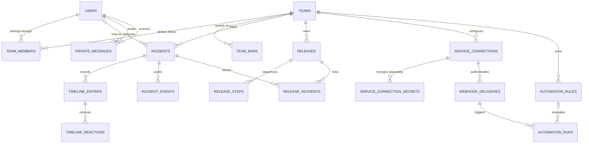

<p align="center">
  
  <h1 align="center">OpsWarden</h1>
</p>

<p align="center">
  <a href="https://github.com/opswarden-git/opswarden/actions/workflows/ci.yml"></a>
  <a href="https://github.com/opswarden-git/opswarden/actions/workflows/release.yml"></a>
  <a href="https://github.com/opswarden-git/opswarden/releases/latest"></a>
  <a href="LICENSE"></a>
  
</p>

<p align="center">
  
  
  
  
  
  
  
  
  
  
</p>

---

- [Product tour](#product-tour) — the product scope through its three primary surfaces
- [How it works](#how-it-works) — install and run locally
- [API and data model](#api-and-data-model) — REST surface and persisted relations
- [WebSocket protocol](WEBSOCKET_SPEC.md) — canonical realtime contract
- [Visual contract](DESIGN_SYSTEM.md) — palette, semantic roles and safe actions
- [Contributing](#contributing) — workflow and Definition of Done

## Introduction

**OpsWarden** is a platform where a technical team coordinates, in real time, its
**Incidents** (unplanned problems, triaged and resolved) and its **Releases**
(deployments validated step by step). The two are linked: an active incident can
block an in-progress release.

External events can automatically trigger internal actions through an
**Action&rarr;REAction** rule engine: the current implementation live-proves a
signed GitHub CI failure webhook creating an incident.

Positioning: a publishable mini incident.io / Rootly focused on reducing MTTR,
rather than yet another re-skinned real-time chat. The tested alpha is delivered
as a Next.js web app and an installable Tauri desktop client, backed by one
Rust/Axum server and PostgreSQL. Rust/Axum was preferred to Node.js so incident
and release transitions remain strongly typed while Tokio handles concurrent
HTTP and WebSocket traffic.

## Product tour

### Incidents

OpsWarden gives responders one shared operational record for an incident: its
severity and lifecycle, current owner, live participant presence, editable
timeline, emoji reactions and activity history. Updates are persisted in
PostgreSQL and broadcast over WebSocket so the web and desktop clients converge
without moving business rules out of the Rust server. PostgreSQL was preferred
to SQLite because concurrent team writes, foreign keys and transactional
lifecycle invariants are central to this multi-user server.

<p align="center">
  <a href="https://raw.githubusercontent.com/wiki/opswarden-git/opswarden/assets/readme/incidents.png">
    
  </a>
</p>

### Releases

Release coordination turns a deployment into an ordered, accountable sequence:
responders validate each step, progress remains visible to the team, and linked
active incidents automatically block unsafe advancement until they are resolved.
This keeps release state and operational risk in the same workspace.

<p align="center">
  <a href="https://raw.githubusercontent.com/wiki/opswarden-git/opswarden/assets/readme/releases.png">
    
  </a>
</p>

### Teams

Teams are the security and collaboration boundary: membership, invitations,
presence and Observer/Responder/Manager permissions govern every operation.
Managers can transfer ownership, moderate or ban members, configure encrypted
GitHub and HTTP integrations, and create Action&rarr;REAction rules; teammates can
also exchange private messages without leaving their shared operational context.

<p align="center">
  <a href="https://raw.githubusercontent.com/wiki/opswarden-git/opswarden/assets/readme/teams.png">
    
  </a>
</p>

## How it works

### Installation

```bash
# 1. Clone
git clone https://github.com/opswarden-git/opswarden.git    # HTTPS
git clone git@github.com:opswarden-git/opswarden.git         # SSH
cd opswarden

# 2. Configure the environment
cp .env.example .env
# adjust OPSWARDEN_KICKOFF_TOKEN and DATABASE_URL if needed

# 3. Run everything (database + server + desktop artifact + web UI)
docker compose up --build
```

Compose starts PostgreSQL, the server on `:8080`, the web app on `:8081`, and a
build-only desktop service that writes Linux packages to `./artifacts`. If
`:8081` is unavailable, set another host port, for example
`CLIENT_WEB_PORT=8091 docker compose up --build`.

Check the services respond:

```bash
curl http://localhost:8080/health      # -> {"status":"ok"}
curl http://localhost:8080/about.json  # -> service catalog + SHA-256 token
curl http://localhost:8081/en          # -> 200, the web UI (FR at /fr)
curl -I http://localhost:8081/client.deb
curl -I http://localhost:8081/client.AppImage
```

### Desktop app (Tauri, URL-mode)

The desktop shell reuses the web UI and adds tray behavior plus native
notifications. Tauri was preferred to Electron because it provides that native
shell without bundling a second Chromium runtime. Run it in development with
`just desktop-dev`, or build and smoke-test the Linux packages through Compose:

```bash
docker compose up --build
curl -I http://localhost:8081/client.deb
curl -I http://localhost:8081/client.AppImage
sudo apt install ./artifacts/OpsWarden_amd64.deb
./artifacts/client.AppImage
```

The delivery smoke test is also runnable independently:

```bash
sh tooling/smoke_compose_appimage.sh
```

Tagged releases rebuild and publish the desktop artifacts through CI.

### Repository layout

```text
opswarden/
├── server/               # Rust/Axum -- ALL business logic (hexagonal)
│   ├── src/
│   │   ├── domain/       # pure models (Incident, Team, Timeline...) -- zero I/O
│   │   ├── ports/        # traits (IncidentRepo, EventBus, TokenVault...)
│   │   ├── app/          # use-cases (business rule orchestration)
│   │   ├── adapters/     # port implementations (Postgres, WS, crypto)
│   │   ├── handlers/     # Axum routes + WebSocket upgrade (no logic)
│   │   ├── config.rs
│   │   └── lib.rs        # build_app(): app testable without opening a socket
│   ├── tests/            # integration tests
│   └── Dockerfile        # multi-stage build of the server binary
├── client-web/           # Next.js + Tailwind -- supervision UI
├── client-desktop/       # Tauri -- URL-mode native app + tray
├── .github/workflows/    # server + web + release CI
├── docker-compose.yml    # compose: db + server + client_desktop + client_web
├── Cargo.toml            # cargo workspace
└── package.json          # npm workspaces
```

### Development

```bash
# Server (Rust)
cd server
cargo run                                   # http://localhost:8080
cargo test                                  # unit + integration tests
cargo clippy --all-targets -- -D warnings   # lint
cargo fmt                                    # format

# Web client (Next.js, from the root via npm workspaces)
npm install
npm run dev --workspace client-web          # http://localhost:4242 (compose exposes 8081)
npm run build --workspace client-web
npm run lint --workspace client-web         # ESLint, blocking
npm run format:check --workspace client-web # Prettier, check only
npm run typecheck --workspace client-web    # TypeScript, no emit
npm run test --workspace client-web         # Vitest
npm run test:coverage --workspace client-web # Vitest + V8 coverage gate
```

`just coverage` runs the complete Rust test suite through Tarpaulin, reports
only runtime code under `server/src`, excludes `main.rs` and test functions,
and enforces 70% source-line coverage. Its JSON, HTML, LCOV, XML and verified
source-only summary are published by CI after every merge to `main`.

The web quality gate uses the flat ESLint 9 configuration in
`client-web/eslint.config.mjs`, based on Next.js Core Web Vitals; errors are
blocking, warnings remain visible, and generated `.next`/coverage output is
ignored.
Vitest measures runtime source under `components`, `i18n`, `lib` and `store`,
while excluding tests and type-only modules. CI enforces at least 70% line,
65% statement/function and 55% branch coverage, and publishes the HTML/LCOV
report after every merge to `main`.

### Services

| Service                                                                                                                                                | Stack       | Local address                   |
| ------------------------------------------------------------------------------------------------------------------------------------------------------ | ----------- | ------------------------------- |
|  <code>db</code> | PostgreSQL  | `localhost:5433`                |
|  <code>server</code>               | Rust / Axum | `http://localhost:8080`         |
|  <code>client_web</code>    | Next.js     | `:4242` dev / `:8081` Compose   |
|  <code>client_desktop</code>                                     | Tauri       | URL mode via `just desktop-dev` |

The cloud and observability showcase lives in the separate
[`opswarden-ops`](https://github.com/opswarden-git/opswarden-ops) repository:

<p>
  
  
  
  
  
  
  
  
  
</p>

## API and data model

JSON endpoints return domain resources directly. Protected routes require
`Authorization: Bearer <JWT>`; authentication failures return `401`, missing
permissions return `403`, and authorized missing resources return `404`.
Domain errors use the stable shape `{ "error": "…", "code": "stable_code" }`.
The WebSocket protocol is documented separately in
[`WEBSOCKET_SPEC.md`](WEBSOCKET_SPEC.md).

<details>
<summary><strong>Complete REST endpoint catalogue</strong></summary>

| Method   | Route                                                                       | Access     | Purpose                                                                    |
| -------- | --------------------------------------------------------------------------- | ---------- | -------------------------------------------------------------------------- |
| `GET`    | `/health`                                                                   | Public     | Liveness probe.                                                            |
| `GET`    | `/about.json?locale=en\|fr`                                                 | Public     | Server time, client host, kickoff hash and localized Automation catalogue. |
| `POST`   | `/api/auth/sign-up`                                                         | Public     | Create an email/password account.                                          |
| `POST`   | `/api/auth/sign-in`                                                         | Public     | Exchange credentials for a JWT.                                            |
| `GET`    | `/api/auth/google/start`                                                    | Public     | Start optional Google OAuth authentication.                                |
| `GET`    | `/api/auth/google/callback`                                                 | Public     | Complete Google OAuth authentication.                                      |
| `GET`    | `/api/service-oauth/github/callback`                                        | Public     | Complete a Team-scoped GitHub connection.                                  |
| `GET`    | `/api/me`                                                                   | JWT        | Read the current profile.                                                  |
| `DELETE` | `/api/me`                                                                   | JWT        | Delete the current account, subject to Manager ownership rules.            |
| `PUT`    | `/api/me/locale`                                                            | JWT        | Persist `en` or `fr` as the profile locale.                                |
| `POST`   | `/api/auth/logout`                                                          | JWT        | Revoke the current token.                                                  |
| `GET`    | `/api/giphy/search?q=…`                                                     | JWT        | Search GIFs through the server-side GIPHY proxy.                           |
| `GET`    | `/api/private-messages?peer_id=…&limit=…`                                   | JWT        | Read one bilateral conversation.                                           |
| `POST`   | `/api/private-messages`                                                     | JWT        | Send a message of at most 2,000 characters to a user sharing a Team.       |
| `GET`    | `/api/teams`                                                                | JWT        | List the current user's Teams and operational counts.                      |
| `POST`   | `/api/teams`                                                                | JWT        | Create a Team; its creator becomes the sole Manager.                       |
| `POST`   | `/api/teams/join`                                                           | JWT        | Join a Team using a valid invitation code.                                 |
| `DELETE` | `/api/teams/{team_id}`                                                      | Manager    | Delete a Team and its owned resources.                                     |
| `POST`   | `/api/teams/{team_id}/leave`                                                | JWT        | Leave a Team; its Manager must transfer ownership first.                   |
| `PUT`    | `/api/teams/{team_id}/manager`                                              | Manager    | Atomically transfer the single Manager role.                               |
| `GET`    | `/api/teams/{team_id}/invitation`                                           | Manager    | Read the invitation code.                                                  |
| `GET`    | `/api/teams/{team_id}/members`                                              | Member     | List members, roles and presence data.                                     |
| `PUT`    | `/api/teams/{team_id}/members/{user_id}/role`                               | Manager    | Set an Observer or Responder role.                                         |
| `DELETE` | `/api/teams/{team_id}/members/{user_id}`                                    | Manager    | Kick a member without rewriting history.                                   |
| `GET`    | `/api/teams/{team_id}/bans`                                                 | Manager    | List temporary and permanent bans.                                         |
| `POST`   | `/api/teams/{team_id}/bans`                                                 | Manager    | Ban a member temporarily or permanently.                                   |
| `DELETE` | `/api/teams/{team_id}/bans/{user_id}`                                       | Manager    | Lift a ban explicitly.                                                     |
| `GET`    | `/api/incidents`                                                            | JWT        | List accessible Incidents, optionally filtered by Team.                    |
| `POST`   | `/api/incidents`                                                            | Manager    | Create an Incident.                                                        |
| `GET`    | `/api/incidents/{incident_id}`                                              | Member     | Read an Incident.                                                          |
| `DELETE` | `/api/incidents/{incident_id}`                                              | Manager    | Permanently delete an Incident after confirmation.                         |
| `PUT`    | `/api/incidents/{incident_id}/status`                                       | Responder+ | Apply a valid lifecycle transition.                                        |
| `PUT`    | `/api/incidents/{incident_id}/assign`                                       | Manager    | Assign a Responder or Manager.                                             |
| `GET`    | `/api/incidents/{incident_id}/activity`                                     | Member     | Read the unified Incident activity stream.                                 |
| `POST`   | `/api/incidents/{incident_id}/timeline`                                     | Responder+ | Add a timeline entry.                                                      |
| `PUT`    | `/api/incidents/{incident_id}/timeline/{entry_id}`                          | Author     | Edit an owned timeline entry while preserving its original timestamp.      |
| `POST`   | `/api/incidents/{incident_id}/timeline/{entry_id}/reactions`                | Member     | Toggle a supported emoji reaction.                                         |
| `GET`    | `/reactions/available`                                                      | JWT        | Read the server-owned reaction catalogue: 👍, 👀, ✅, 🚨, ❤️, 🎉.          |
| `GET`    | `/api/releases`                                                             | JWT        | List accessible Releases, optionally filtered by Team.                     |
| `POST`   | `/api/releases`                                                             | Manager    | Create a Release with ordered steps.                                       |
| `GET`    | `/api/releases/{id}`                                                        | Member     | Read a Release, its steps and linked Incidents.                            |
| `POST`   | `/api/releases/{id}/cancel`                                                 | Manager    | Cancel a Release.                                                          |
| `POST`   | `/api/releases/{id}/steps/{step}/validate`                                  | Responder+ | Validate the next available step.                                          |
| `POST`   | `/api/releases/{id}/incidents/{incident_id}/link`                           | Manager    | Link an Incident and derive blocking state.                                |
| `DELETE` | `/api/releases/{id}/incidents/{incident_id}/link`                           | Manager    | Unlink an Incident.                                                        |
| `GET`    | `/api/teams/{team_id}/service-connections`                                  | Manager    | List connection metadata without secret material.                          |
| `PUT`    | `/api/teams/{team_id}/service-connections/by-service/{service}`             | Manager    | Configure a catalogue-driven service connection.                           |
| `PUT`    | `/api/teams/{team_id}/service-connections/github`                           | Manager    | Configure GitHub credentials or webhook signing.                           |
| `PUT`    | `/api/teams/{team_id}/service-connections/http`                             | Manager    | Configure a bounded HTTP notification destination.                         |
| `POST`   | `/api/teams/{team_id}/service-connections/by-service/{service}/oauth/start` | Manager    | Start service OAuth with state and PKCE.                                   |
| `POST`   | `/api/teams/{team_id}/service-connections/{connection_id}/oauth/refresh`    | Manager    | Rotate encrypted GitHub OAuth credentials.                                 |
| `POST`   | `/api/teams/{team_id}/service-connections/{connection_id}/test`             | Manager    | Test an HTTP connection without exposing its endpoint.                     |
| `DELETE` | `/api/teams/{team_id}/service-connections/{connection_id}`                  | Manager    | Delete a connection and its encrypted credentials.                         |
| `GET`    | `/api/teams/{team_id}/automation-rules`                                     | Manager    | List Action→REAction rules.                                                |
| `POST`   | `/api/teams/{team_id}/automation-rules`                                     | Manager    | Create a disabled-by-default rule.                                         |
| `PATCH`  | `/api/teams/{team_id}/automation-rules/{rule_id}`                           | Manager    | Update or enable a rule.                                                   |
| `DELETE` | `/api/teams/{team_id}/automation-rules/{rule_id}`                           | Manager    | Delete a rule while preserving run history.                                |
| `GET`    | `/api/teams/{team_id}/automation-runs`                                      | Manager    | List Automation executions and outcomes.                                   |
| `POST`   | `/webhooks/github/{connection_id}`                                          | HMAC       | Receive a size-limited, signed GitHub event idempotently.                  |

</details>

<details>
<summary><strong>Commented PostgreSQL relationship model</strong></summary>


```mermaid
erDiagram
    USERS ||--o{ TEAM_MEMBERS : "belongs through"
    TEAMS ||--o{ TEAM_MEMBERS : "defines RBAC"
    TEAMS ||--o{ TEAM_BANS : "guards re-entry"
    TEAMS ||--o{ INCIDENTS : owns
    USERS o|--o{ INCIDENTS : "may be assigned"
    INCIDENTS ||--o{ TIMELINE_ENTRIES : records
    TIMELINE_ENTRIES ||--o{ TIMELINE_REACTIONS : receives
    INCIDENTS ||--o{ INCIDENT_EVENTS : audits
    TEAMS ||--o{ RELEASES : owns
    RELEASES ||--|{ RELEASE_STEPS : sequences
    RELEASES ||--o{ RELEASE_INCIDENTS : links
    INCIDENTS ||--o{ RELEASE_INCIDENTS : blocks
    USERS ||--o{ PRIVATE_MESSAGES : sends
    USERS ||--o{ PRIVATE_MESSAGES : receives
    TEAMS ||--o{ SERVICE_CONNECTIONS : configures
    SERVICE_CONNECTIONS ||--o{ SERVICE_CONNECTION_SECRETS : "encrypts separately"
    TEAMS ||--o{ AUTOMATION_RULES : owns
    SERVICE_CONNECTIONS ||--o{ WEBHOOK_DELIVERIES : authenticates
    WEBHOOK_DELIVERIES ||--o{ AUTOMATION_RUNS : triggers
    AUTOMATION_RULES o|--o{ AUTOMATION_RUNS : evaluates
```

- `users`, `teams` and `team_members` form the identity and RBAC boundary; a
  partial unique index enforces one Manager per Team.
- Incident timelines, events and reactions preserve their historical author or
  actor semantics across moderation.
- Releases own ordered steps and use `release_incidents` to derive blocked state
  from active Incidents.
- Automation secrets are encrypted outside connection metadata; deliveries and
  runs retain idempotency and audit history without returning credentials.
- `revoked_tokens` persists logout invalidation. Versioned migrations under
  `server/migrations/` are the canonical executable schema.

</details>

## Contributing

Use short-lived `feat/`, `fix/`, `chore/`, `docs/` or `test/` branches and
conventional commits. Pull requests are squash-merged into protected `main` and
must satisfy the [Definition of Done](.github/pull_request_template.md).

## License

OpsWarden is distributed under the **Apache License 2.0**. See [LICENSE](LICENSE)
and [NOTICE](NOTICE).
