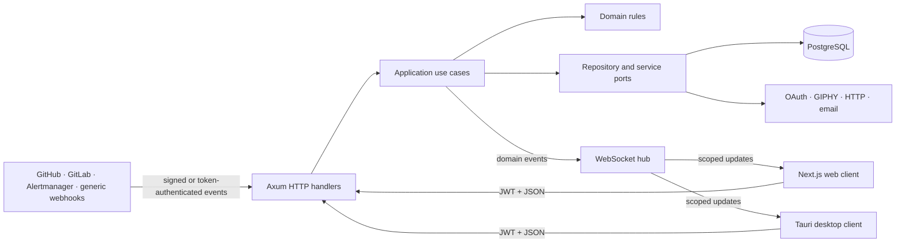
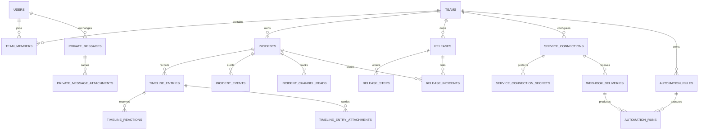

> [!NOTE]
> **Project status: paused**
>
> OpsWarden was developed as an academic project, and its assessment is now
> complete. Active development and the public cloud deployment are therefore
> paused for the time being. This is not necessarily a permanent shutdown:
> substantial changes are planned, and OpsWarden may reopen in a new form.
> Until then, the source remains available—feel free to fork it.

<div align="center">
  
  <h1>OpsWarden</h1>
  <p>
    <a href="https://github.com/opswarden-git/opswarden/actions/workflows/validate.yml"></a>
    
    <a href="LICENSE"></a>
    
    
    
    
  </p>
</div>

## What is OpsWarden?

**OpsWarden** is a real-time incident response and release coordination platform
for technical teams.

Streamline incident response and eliminate deployment risks in one unified
workspace. Responders collaborate seamlessly while release pipelines run
step-by-step validations that automatically halt unsafe deployments whenever active
incidents arise. Powered by an event-driven **Action -> REAction** engine, OpsWarden
connects your stack—from GitHub and GitLab to custom webhooks—to instantly convert
CI events, new tags, and pull requests into automated incident triage, release
controls, and escalation workflows with enterprise-grade security and deduplication.

<details>
<summary><strong>Incident response</strong></summary>

OpsWarden gives responders one shared operational record for an incident: its
severity and lifecycle, current owner, live participant presence, editable
timeline, emoji reactions and activity history. Updates are persisted in
PostgreSQL and broadcast over WebSocket so the web and desktop clients converge
without moving business rules out of the Rust server. PostgreSQL was preferred
to SQLite because concurrent team writes, foreign keys and transactional
lifecycle invariants are central to this multi-user server.

<p align="center">
  <a href="https://raw.githubusercontent.com/wiki/opswarden-git/opswarden/assets/readme/incidents.png">
    
  </a>
</p>

</details>

<details>
<summary><strong>Safe release coordination</strong></summary>

Release coordination turns a deployment into an ordered, accountable sequence:
responders validate each step, progress remains visible to the team, and linked
active incidents automatically block unsafe advancement until they are resolved.
This keeps release state and operational risk in the same workspace.

<p align="center">
  <a href="https://raw.githubusercontent.com/wiki/opswarden-git/opswarden/assets/readme/releases.png">
    
  </a>
</p>

</details>

<details>
<summary><strong>Team operations</strong></summary>

Teams are the security and collaboration boundary: membership, join codes,
presence and Observer/Responder/Manager permissions govern every operation.
Managers can add members directly, share a join code, transfer ownership,
moderate or ban members, while teammates exchange private messages without
leaving their shared operational context.

<p align="center">
  <a href="https://raw.githubusercontent.com/wiki/opswarden-git/opswarden/assets/readme/teams.png">
    
  </a>
</p>

</details>

<details>
<summary><strong>Integrations and automations</strong></summary>

Team-scoped connections cover GitHub, GitLab, Alertmanager, Generic Webhook,
HTTP and Email. Active and inactive integrations remain visibly separate while
credentials stay server-side; connected services can then feed the durable
Action -> REAction rule engine.

<p align="center">
  <a href="https://raw.githubusercontent.com/wiki/opswarden-git/opswarden/assets/readme/integrations.png">
    
  </a>
</p>

</details>

The tested alpha ships as a Next.js web app and an installable Tauri desktop
client backed by a Rust/Axum server and PostgreSQL. Rust keeps lifecycle rules
strongly typed, PostgreSQL protects concurrent multi-user state, and Tauri adds
native desktop behavior without introducing a second application architecture.

<p>
  
  
  
  
  
  
  
  
</p>

When it comes to production deployment, we take infrastructure seriously. The [`opswarden-ops`](https://github.com/opswarden-git/opswarden-ops) repository houses all of our cloud and observability engineering. We rely on modern tooling to keep the platform reliable and observable:

<p>
  
  
  
  
  
  
  
  
  
</p>

Finally, if you're looking for our public-facing presentation, you can find the Next.js source code for our landing page in the [`opswarden-website`](https://github.com/opswarden-git/opswarden-website) repository.

<p>
  
  
  
  
  
  
</p>

## For developers

OpsWarden is built to be run both locally for development and in the cloud for production. To get a feel for the platform on your own machine, you can launch the entire stack in just a few commands using Docker:

```bash
git clone https://github.com/opswarden-git/opswarden.git
cd opswarden
cp .env.example .env
docker compose up --build
```

Once the containers are up, open `http://localhost:8081/en` (`/fr` for French). Here is a breakdown of the services that are running:

| Icon                                                                                                                         | Service          | Stack       | Local address                   |
| ---------------------------------------------------------------------------------------------------------------------------- | ---------------- | ----------- | ------------------------------- |
|  | `db`             | PostgreSQL  | `localhost:5433`                |
|              | `server`         | Rust / Axum | `http://localhost:8080`         |
|          | `client_web`     | Next.js     | `:4242` dev / `:8081` Compose   |
|                                             | `client_desktop` | Tauri       | URL mode via `just desktop-dev` |

### Reproducible presentation dataset

The presentation profile targets one Team created through the real onboarding
flow. It replaces that Team's incidents, releases, automation rules and
non-Manager memberships with a deterministic narrative, while preserving the
Team, Manager account, users and configured service connections.

```bash
python3 tooling/demo.py doctor --target local
just demo-presentation
python3 tooling/demo.py deseed --target local
```

Production operations use the same fixture but require both a production HTTPS
API origin and an explicit confirmation such as `--confirm SEED_PRODUCTION`.
OAuth Manager accounts use `--prompt-token`; credentials remain in the ignored
`.env` file and are never embedded in the SQL fixture.
The complete local/production procedure and every `DEMO_` variable are covered
in [`docs/INTEGRATION_GUIDE.md`](docs/INTEGRATION_GUIDE.md).

For deeper setup and operational guidance, please see:

<details>
<summary><strong>Architecture</strong></summary>

The Rust server owns authorization, lifecycle rules and persistence. The web
and desktop clients consume the same HTTP and WebSocket contracts; the desktop
application is a Tauri shell around the web client, not a second business
implementation.


```mermaid
flowchart LR
    Providers[GitHub · GitLab · Alertmanager · generic webhooks]
    Browser[Next.js web client]
    Desktop[Tauri desktop client]
    API[Axum HTTP handlers]
    App[Application use cases]
    Domain[Domain rules]
    Ports[Repository and service ports]
    Postgres[(PostgreSQL)]
    Hub[WebSocket hub]
    External[OAuth · GIPHY · HTTP · email]

    Providers -->|signed or token-authenticated events| API
    Browser -->|JWT + JSON| API
    Desktop -->|JWT + JSON| API
    API --> App
    App --> Domain
    App --> Ports
    Ports --> Postgres
    Ports --> External
    App -->|domain events| Hub
    Hub -->|scoped updates| Browser
    Hub -->|scoped updates| Desktop
```

</details>

<details>
<summary><strong>Codebase navigation</strong></summary>

| Concern                          | Location                                                                                           | Responsibility                                                                        |
| -------------------------------- | -------------------------------------------------------------------------------------------------- | ------------------------------------------------------------------------------------- |
| Business entities and invariants | [`server/src/domain`](server/src/domain)                                                           | Incident and Release lifecycles, roles, message limits, automations and domain events |
| Application logic                | [`server/src/app`](server/src/app)                                                                 | Use cases coordinating authorization, mutations, persistence and event publication    |
| Abstract dependencies            | [`server/src/ports`](server/src/ports)                                                             | Repository, token, webhook, notification and external-service traits                  |
| HTTP handlers and payloads       | [`server/src/handlers`](server/src/handlers)                                                       | Axum extraction, DTOs and transport error mapping                                     |
| HTTP route wiring                | [`server/src/lib.rs`](server/src/lib.rs)                                                           | Router, middleware boundaries, body limits and shared state                           |
| PostgreSQL persistence           | [`server/src/adapters/pg`](server/src/adapters/pg)                                                 | SQL-backed repository implementations                                                 |
| WebSocket broadcaster            | [`server/src/adapters/ws/hub.rs`](server/src/adapters/ws/hub.rs)                                   | Connection registration and Team, Incident-room or bilateral delivery                 |
| WebSocket wire format            | [`server/src/adapters/ws/protocol.rs`](server/src/adapters/ws/protocol.rs)                         | Stable JSON representation of domain events                                           |
| Database evolution               | [`server/migrations`](server/migrations)                                                           | Immutable expand/backfill/contract migrations                                         |
| Next.js routes and UI            | [`client-web/app`](client-web/app), [`client-web/components`](client-web/components)               | Locale-aware pages, product views and accessible primitives                           |
| Client data and realtime         | [`client-web/lib/queries`](client-web/lib/queries), [`client-web/lib/ws.ts`](client-web/lib/ws.ts) | Typed HTTP access, caching and WebSocket synchronization                              |
| Desktop shell                    | [`client-desktop/src-tauri`](client-desktop/src-tauri)                                             | Tauri packaging, native window behavior and notifications                             |

</details>

<details>
<summary><strong>REST API reference</strong></summary>

JSON failures carry a stable `code`. Unless marked Public or Provider, routes
require `Authorization: Bearer &lt;token&gt;`; Team routes also enforce membership
and Observer/Responder/Manager permissions. IDs are UUIDs and timestamps use
RFC 3339. DTO definitions live beside the handlers in
[`server/src/handlers`](server/src/handlers).

#### System and account

| Method          | Path                                 | Access and purpose                           |
| --------------- | ------------------------------------ | -------------------------------------------- |
| `GET`           | `/health`                            | Public readiness check                       |
| `GET`           | `/metrics`                           | Public Prometheus metrics                    |
| `GET`           | `/about.json`                        | Public version and capability catalogue      |
| `POST`          | `/api/auth/sign-up`                  | Public, rate-limited account creation        |
| `POST`          | `/api/auth/sign-in`                  | Public, rate-limited token exchange          |
| `GET`           | `/api/auth/google/start`             | Public, rate-limited Google OAuth start      |
| `GET`           | `/api/auth/google/callback`          | Public Google OAuth callback                 |
| `POST`          | `/api/auth/logout`                   | Revoke the authenticated token               |
| `GET`, `DELETE` | `/api/me`                            | Read or delete the authenticated account     |
| `PUT`           | `/api/me/locale`                     | Persist `en` or `fr`                         |
| `GET`           | `/api/giphy/search`                  | Search bounded, normalized GIF results       |
| `GET`           | `/api/service-oauth/github/callback` | Complete a state-protected GitHub connection |

#### Teams and direct collaboration

| Method                 | Path                                          | Access and purpose                                       |
| ---------------------- | --------------------------------------------- | -------------------------------------------------------- |
| `GET`, `POST`          | `/api/teams`                                  | List the caller's Teams or create one as Manager         |
| `POST`                 | `/api/teams/join`                             | Join using an invitation code                            |
| `GET`, `POST`          | `/api/teams/{team_id}/members`                | Member roster; Manager-only addition                     |
| `PUT`                  | `/api/teams/{team_id}/members/{user_id}/role` | Manager role change                                      |
| `DELETE`               | `/api/teams/{team_id}/members/{user_id}`      | Manager member removal                                   |
| `GET`, `POST`          | `/api/teams/{team_id}/bans`                   | Manager ban list or ban creation                         |
| `DELETE`               | `/api/teams/{team_id}/bans/{user_id}`         | Manager unban                                            |
| `GET`                  | `/api/teams/{team_id}/invitation`             | Manager invitation-code read                             |
| `GET`, `PUT`, `DELETE` | `/api/teams/{team_id}/image`                  | Member read; Manager replace or delete                   |
| `POST`                 | `/api/teams/{team_id}/leave`                  | Leave when ownership rules permit it                     |
| `PUT`                  | `/api/teams/{team_id}/manager`                | Manager ownership transfer                               |
| `DELETE`               | `/api/teams/{team_id}`                        | Manager Team deletion                                    |
| `GET`, `POST`          | `/api/private-messages`                       | Shared-Team participants list or send bilateral messages |
| `PATCH`                | `/api/private-messages/{id}`                  | Original-author edit                                     |
| `POST`                 | `/api/private-messages/read`                  | Advance a bilateral read position                        |
| `GET`                  | `/api/private-messages/unread`                | List peers with unread messages                          |
| `GET`                  | `/api/private-message-attachments/{id}`       | Participant-only attachment download                     |

#### Incidents and Releases

| Method           | Path                                                         | Access and purpose                       |
| ---------------- | ------------------------------------------------------------ | ---------------------------------------- |
| `GET`, `POST`    | `/api/incidents`                                             | Member list/filter; Manager creation     |
| `GET`, `DELETE`  | `/api/incidents/{incident_id}`                               | Member detail; Manager deletion          |
| `PUT`            | `/api/incidents/{incident_id}/status`                        | Responder/Manager lifecycle transition   |
| `PUT`            | `/api/incidents/{incident_id}/assign`                        | Manager Responder assignment             |
| `GET`            | `/api/incidents/{incident_id}/activity`                      | Member keyset-paginated activity         |
| `PUT`            | `/api/incidents/{incident_id}/read`                          | Advance a member's durable read position |
| `POST`           | `/api/incidents/{incident_id}/timeline`                      | Responder/Manager note or attachment     |
| `PUT`            | `/api/incidents/{incident_id}/timeline/{entry_id}`           | Original-author note edit                |
| `POST`           | `/api/incidents/{incident_id}/timeline/{entry_id}/reactions` | Member emoji toggle                      |
| `GET`            | `/api/timeline-attachments/{attachment_id}`                  | Authorized attachment download           |
| `GET`            | `/reactions/available`                                       | Authenticated canonical emoji catalogue  |
| `GET`, `POST`    | `/api/releases`                                              | Member list; Manager creation            |
| `GET`            | `/api/releases/{id}`                                         | Member Release detail                    |
| `POST`           | `/api/releases/{id}/cancel`                                  | Manager cancellation                     |
| `POST`           | `/api/releases/{id}/steps/{step}/validate`                   | Responder/Manager next-step validation   |
| `POST`, `DELETE` | `/api/releases/{id}/incidents/{incident_id}/link`            | Responder/Manager link or unlink         |

#### Integrations and automations

| Method            | Path                                                                        | Access and purpose                      |
| ----------------- | --------------------------------------------------------------------------- | --------------------------------------- |
| `GET`             | `/api/teams/{team_id}/service-connections`                                  | Manager connection list without secrets |
| `PUT`             | `/api/teams/{team_id}/service-connections/by-service/{service}`             | Manager service configuration           |
| `POST`            | `/api/teams/{team_id}/service-connections/by-service/{service}/oauth/start` | Manager GitHub OAuth start              |
| `POST`            | `/api/teams/{team_id}/service-connections/{connection_id}/oauth/refresh`    | Manager OAuth refresh                   |
| `POST`            | `/api/teams/{team_id}/service-connections/{connection_id}/test`             | Manager safe connectivity test          |
| `DELETE`          | `/api/teams/{team_id}/service-connections/{connection_id}`                  | Manager connection deletion             |
| `GET`, `POST`     | `/api/teams/{team_id}/automation-rules`                                     | Manager rule list or creation           |
| `PATCH`, `DELETE` | `/api/teams/{team_id}/automation-rules/{rule_id}`                           | Manager update or deletion              |
| `GET`             | `/api/teams/{team_id}/automation-runs`                                      | Manager durable execution history       |
| `POST`            | `/webhooks/github/{connection_id}`                                          | Provider-signature GitHub ingestion     |
| `POST`            | `/webhooks/gitlab/{connection_id}`                                          | Provider-token GitLab ingestion         |
| `POST`            | `/webhooks/generic/{connection_id}`                                         | Connection-token bounded JSON ingestion |
| `POST`            | `/webhooks/alertmanager/{connection_id}`                                    | Bearer-token alert ingestion            |

The non-REST real-time endpoint is `GET` `/ws`: its first message authenticates
the client, then room messages scope delivery. See
[`WEBSOCKET_SPEC.md`](docs/WEBSOCKET_SPEC.md) for the wire contract.

</details>

<details>
<summary><strong>Commented PostgreSQL schema</strong></summary>

The diagram shows the principal ownership and collaboration relationships.
Team-owned resources generally cascade on deletion; retained operational history
uses `SET NULL` when an actor account disappears.


```mermaid
erDiagram
    USERS ||--o{ TEAM_MEMBERS : joins
    TEAMS ||--o{ TEAM_MEMBERS : contains
    TEAMS ||--o{ INCIDENTS : owns
    INCIDENTS ||--o{ TIMELINE_ENTRIES : records
    TIMELINE_ENTRIES ||--o{ TIMELINE_REACTIONS : receives
    TIMELINE_ENTRIES ||--o{ TIMELINE_ENTRY_ATTACHMENTS : carries
    INCIDENTS ||--o{ INCIDENT_EVENTS : audits
    INCIDENTS ||--o{ INCIDENT_CHANNEL_READS : tracks
    TEAMS ||--o{ RELEASES : owns
    RELEASES ||--o{ RELEASE_STEPS : orders
    RELEASES ||--o{ RELEASE_INCIDENTS : links
    INCIDENTS ||--o{ RELEASE_INCIDENTS : blocks
    USERS ||--o{ PRIVATE_MESSAGES : exchanges
    PRIVATE_MESSAGES ||--o{ PRIVATE_MESSAGE_ATTACHMENTS : carries
    TEAMS ||--o{ SERVICE_CONNECTIONS : configures
    SERVICE_CONNECTIONS ||--o{ SERVICE_CONNECTION_SECRETS : protects
    TEAMS ||--o{ AUTOMATION_RULES : owns
    AUTOMATION_RULES ||--o{ AUTOMATION_RUNS : executes
    SERVICE_CONNECTIONS ||--o{ WEBHOOK_DELIVERIES : receives
    WEBHOOK_DELIVERIES ||--o{ AUTOMATION_RUNS : produces
```

| Tables                                                                     | Comment                                                              |
| -------------------------------------------------------------------------- | -------------------------------------------------------------------- |
| `users`, `revoked_tokens`                                                  | Accounts, locale and revoked sessions                                |
| `teams`, `team_members`, `team_bans`, `team_images`                        | Ownership, RBAC, moderation and bounded branding                     |
| `incidents`, `incident_events`, `incident_channel_reads`                   | Current projection, audit history and per-user read positions        |
| `timeline_entries`, `timeline_reactions`, `timeline_entry_attachments`     | Incident notes, Incident-only reactions and bounded files            |
| `releases`, `release_steps`, `release_incidents`                           | Ordered progress and Incident-derived blocking                       |
| `private_messages`, `private_message_attachments`, `private_message_reads` | Bilateral messages, files and unread positions; no private reactions |
| `service_connections`, `service_connection_secrets`                        | Integration metadata and separately encrypted credentials            |
| `automation_rules`, `automation_runs`, `webhook_deliveries`                | Rules, durable outcomes and delivery deduplication                   |
| `automation_timer_schedules`, `automation_timer_occurrences`               | Schedules and exactly-once timer claims                              |

The ordered files in [`server/migrations`](server/migrations) are the executable,
authoritative schema.

</details>

<details>
<summary><strong>Collaboration limits</strong></summary>

The server owns and enforces these values. Clients mirror attachment limits for
early feedback; server validation remains authoritative.

| Rule                          | Value                                                              | Served by                                         |
| ----------------------------- | ------------------------------------------------------------------ | ------------------------------------------------- |
| Timeline reaction set         | 👍 👀 ✅ 🚨 ❤️ 🎉 — six emojis, anything else is rejected          | `GET /reactions/available`                        |
| Conversation text length      | 2 000 characters                                                   | Incident timeline and private-message POST routes |
| Attachments per message       | 4 files; 5 MiB each; 10 MiB combined                               | Incident timeline and private-message POST routes |
| Attachment media policy       | Download-only allowlist; active HTML is rejected                   | Incident timeline and private-message POST routes |
| Unauthenticated auth attempts | 20 per client address per 5 minutes, then `429` with `Retry-After` | `/api/auth/*`                                     |

Reactions apply only to Incident timeline entries, never to private messages or
Release step validations.

</details>

## Contributing

Work from a short-lived branch and keep changes focused on the core platform. Formatting, linting, type checks, tests and the production build must pass before a squash merge into `main`.

Please follow the rules and design standards stated in:

- [Technical documentation](https://opswarden-git.github.io/opswarden/)
- [WebSocket protocol](docs/WEBSOCKET_SPEC.md)
- [Design system](docs/DESIGN_SYSTEM.md)
- [UI guidelines](docs/UI_GUIDELINES.md)
- [Contribution guide](docs/HOWTOCONTRIBUTE.md)

The executable source-hygiene, migration and container-pin policies are enforced by the required CI gate.

<p align="center">
  
</p>
