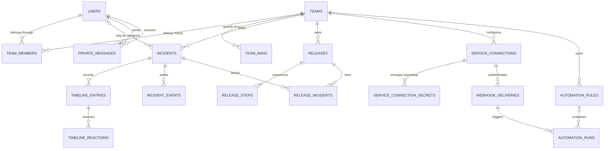

<p align="center">
  
  <h1 align="center">OpsWarden</h1>
</p>

<p align="center">
  <a href="https://github.com/opswarden-git/opswarden/actions/workflows/ci.yml"></a>
  <a href="https://github.com/opswarden-git/opswarden/actions/workflows/release.yml"></a>
  <a href="https://github.com/opswarden-git/opswarden/releases/latest"></a>
  <a href="LICENSE"></a>
  
</p>

<p align="center">
  
  
  
  
  
  
  
  
  
  
</p>

---

- [Scope](#scope) — what ships, in tiers
- [Product tour](#product-tour) — the three primary operational surfaces
- [How it works](#how-it-works) — install and run locally
- [Architecture](#architecture) — hexagonal, where things live
- [API and data model](#api-and-data-model) — REST surface and persisted relations
- [WebSocket protocol](WEBSOCKET_SPEC.md) — canonical realtime contract
- [Visual contract](DESIGN_SYSTEM.md) — palette, semantic roles and safe actions
- [Roadmap](#roadmap) — project milestones
- [Contributing](#contributing) — workflow and Definition of Done

## Introduction

**OpsWarden** is a platform where a technical team coordinates, in real time, its
**Incidents** (unplanned problems, triaged and resolved) and its **Releases**
(deployments validated step by step). The two are linked: an active incident can
block an in-progress release.

External events can automatically trigger internal actions through an
**Action&rarr;REAction** rule engine: the current implementation live-proves a
signed GitHub CI failure webhook creating an incident. GitLab and an AI SRE
investigation agent remain roadmap items rather than shipped alpha features.

Positioning: a publishable mini incident.io / Rootly focused on reducing MTTR,
rather than yet another re-skinned real-time chat. All business logic lives on the
server (Rust/Axum, hexagonal architecture); the web and desktop clients display
and relay, with no business logic.

> Status: the alpha **product** is implemented and tested — email/JWT auth
> (with logout/revocation), teams + 3-role RBAC, incident lifecycle, real-time
> roster presence, timeline editing, emoji reactions, member moderation,
> private messages, and GIPHY-powered GIF timeline entries, all on PostgreSQL
> (SQLx). Release management is implemented with step validation and automatic
> blocking by linked incidents. Desktop is delivered as an installable Tauri
> URL-mode shell with tray/background behavior and native assignment,
> direct-critical Incident, critical-escalation, and `release_blocked`
> notifications. Notification delivery remains active while the window is
> hidden and suppresses duplicate WebSocket replays. Compose builds and validates
> both an installable Linux `.deb` and a Type 2 AppImage, then serves them through
> `client_web` without a manual artifact copy.

## Product tour

<p align="center">
  <a href="https://raw.githubusercontent.com/wiki/opswarden-git/opswarden/assets/readme/incidents.png">
    
  </a>
</p>

<table>
  <tr>
    <td width="50%" align="center">
      <a href="https://raw.githubusercontent.com/wiki/opswarden-git/opswarden/assets/readme/releases.png">
        
      </a>
      <br /><sub>Ordered releases, progress and incident-driven blockers.</sub>
    </td>
    <td width="50%" align="center">
      <a href="https://raw.githubusercontent.com/wiki/opswarden-git/opswarden/assets/readme/teams.png">
        
      </a>
      <br /><sub>Team scope, membership and operational ownership.</sub>
    </td>
  </tr>
</table>

## Scope

OpsWarden aims to be a real Incident Management Platform, in the lineage of
**PagerDuty, Opsgenie, incident.io, Rootly and Datadog Incident Management**,
delivered in tiers. Locked architecture decision: a modular hexagonal monolith
(cargo + npm workspaces) for the core, **a single extracted service** (the AI SRE
agent, behind a port), and the cloud/ops layer in **separate repositories** — the
microservices instinct is honored where it pays, without distributed-systems tax.

**Core Features**

- Email auth + JWT, `/me`, logout with token invalidation; teams + 3-role RBAC
  (Observer / Responder / Manager) + invitation code + Manager transfer
- Incidents (open &rarr; acknowledged &rarr; escalated &rarr; resolved, severities)
  with a real-time collaborative timeline, inline edits and emoji reactions
- WebSockets (`incident_*`, `presence_update`) + automatic client reconnection
- Action&rarr;REAction automation: GitHub webhook (CI failed) &rarr; incident;
  dynamic `/about.json` + SHA-256 token; encrypted token vault (AES-GCM)
- Team GitHub connections support an authorization-code OAuth flow with
  anti-CSRF `state` and PKCE S256. A GitHub App with expiring user tokens stores
  both access and refresh tokens encrypted in the Team vault, supports rotation,
  and never returns token material through the API. PAT remains available as a
  manual alternative.
- Team member moderation: kick, temporary ban, permanent ban, ban-gated rejoin
- Private messages between users sharing a team, limited to **2,000 characters**
  by the server and delivered over a user-scoped WebSocket event
- GIPHY GIF search via a server-side API key and authenticated backend proxy
- Releases with ordered step validation and automatic blocking/unblocking by
  linked incident state
- `docker-compose` for database + server + desktop artifact + web client; GitHub Actions
  CI/CD; FR/EN i18n with the profile preference persisted in PostgreSQL
- Keyboard-complete web interactions with managed dialog/menu focus, explicit
  labels for every form control, live error announcements, and an automated
  accessibility contract preventing placeholder-only labels or positive tab order

**Extended Features** (in progress / planned)

- Tauri desktop URL-mode shell is present (OS notifications + tray); Compose
  builds and serves both the `.deb` and canonical AppImage
- Google OAuth2 exists as optional auth plumbing
- GitLab as an Action; additional REActions (Slack / HTTP / Email)

**Long-term vision**

- **AI SRE**: RAG microservice (FastAPI, `@ask` / `@search`, pgvector, LLM/SLM)
  correlating logs + commit diff + past incidents to propose a root cause + runbook
- **Integrations**: Slack, Jira / Confluence
- **Observability**: OpenTelemetry + Prometheus + Grafana + Loki + Promtail
- **IaC showcase** (repo `opswarden-ops`): Minikube &rarr; k8s &rarr; Terraform &rarr;
  DigitalOcean (DOKS) + Traefik + cAdvisor + Argo/Flux; Redis + async workers
- **Deployment**: Vercel (web) + multi-repo (product monorepo v1, separate ops repos)

## How it works

### Installation

```bash
# 1. Clone
git clone https://github.com/opswarden-git/opswarden.git    # HTTPS
git clone git@github.com:opswarden-git/opswarden.git         # SSH
cd opswarden

# 2. Configure the environment
cp .env.example .env
# adjust OPSWARDEN_KICKOFF_TOKEN and DATABASE_URL if needed

# 3. Run everything (database + server + desktop artifact + web UI)
docker compose up --build
```

Compose brings up `db`, the `server` on `:8080`, a build-only `client_desktop`
service that deposits the Linux desktop package in `./artifacts`, and the
production `client_web` on **`:8081`** (the Next.js UI, also the URL-mode target
the desktop build loads). `client_web` proxies `/api/*` to the server over the
compose network; the browser reaches the WebSocket directly on the server's
published `:8080`. If host port `8081` is already in use, run
`CLIENT_WEB_PORT=8091 docker compose up --build`; the container still listens on
`:8081` internally.

Check the services respond:

```bash
curl http://localhost:8080/health      # -> {"status":"ok"}
curl http://localhost:8080/about.json  # -> service catalog + SHA-256 token
curl http://localhost:8081/en          # -> 200, the web UI (FR at /fr)
curl -I http://localhost:8081/client.deb
curl -I http://localhost:8081/client.AppImage
```

### Desktop app (Tauri, URL-mode)

The desktop shell loads the web UI from `http://localhost:8081`, so it needs the
compose stack (or a dev server) running. In dev: `just desktop-dev`.

A build-only `client_desktop` compose service builds an installable `.deb` and
Type 2 AppImage in an Ubuntu/FHS container, smoke-tests the AppImage, and drops
both under `./artifacts`. `client_web` waits for that successful build and exposes
both packages over HTTP:

```bash
docker compose up --build
curl -I http://localhost:8081/client.deb
curl -I http://localhost:8081/client.AppImage
sudo apt install ./artifacts/OpsWarden_amd64.deb
./artifacts/client.AppImage
```

The container runs AppImage helpers without FUSE, validates the Type 2 signature,
extracts the bundle, checks its executable and shared libraries, and launches it
under a virtual display. The HTTP delivery contract is reproducible separately:

```bash
sh tooling/smoke_compose_appimage.sh
```

The release CI independently rebuilds the AppImage on Ubuntu 22.04 and attaches
it to tagged GitHub Releases.

### The project at a glance

```text
opswarden/
├── server/               # Rust/Axum -- ALL business logic (hexagonal)
│   ├── src/
│   │   ├── domain/       # pure models (Incident, Team, Timeline...) -- zero I/O
│   │   ├── ports/        # traits (IncidentRepo, EventBus, TokenVault...)
│   │   ├── app/          # use-cases (business rule orchestration)
│   │   ├── adapters/     # port implementations (Postgres, WS, crypto)
│   │   ├── handlers/     # Axum routes + WebSocket upgrade (no logic)
│   │   ├── config.rs
│   │   └── lib.rs        # build_app(): app testable without opening a socket
│   ├── tests/            # integration tests
│   └── Dockerfile        # multi-stage build of the server binary
├── client-web/           # Next.js + Tailwind -- supervision UI
├── client-desktop/       # Tauri -- URL-mode native app + tray (alpha)
├── investigation/        # AI SRE agent (RAG / pgvector) (planned, not in repo yet)
├── .github/workflows/    # server + web + release CI
├── docker-compose.yml    # compose: db + server + client_desktop + client_web
├── Cargo.toml            # cargo workspace
└── package.json          # npm workspaces
```

### Development

```bash
# Server (Rust)
cd server
cargo run                                   # http://localhost:8080
cargo test                                  # unit + integration tests
cargo clippy --all-targets -- -D warnings   # lint
cargo fmt                                    # format

# Web client (Next.js, from the root via npm workspaces)
npm install
npm run dev --workspace client-web          # http://localhost:4242 (compose exposes 8081)
npm run build --workspace client-web
npm run lint --workspace client-web         # ESLint, blocking
npm run format:check --workspace client-web # Prettier, check only
npm run typecheck --workspace client-web    # TypeScript, no emit
npm run test --workspace client-web         # Vitest
```

The web client uses the ESLint 9 flat configuration in
`client-web/eslint.config.mjs`. It applies Next.js `core-web-vitals` rules to
application and test code and ignores only generated `.next/**` output. ESLint,
Prettier and TypeScript errors are blocking in CI; exceptions must be local,
justified inline and reviewed rather than added as broad repository-wide
disables.

### Services

| Service                                                                                                                          | Stack        | Local address                   |
| -------------------------------------------------------------------------------------------------------------------------------- | ------------ | ------------------------------- |
| `` `db`    | PostgreSQL   | `localhost:5433`                |
| `` `server`            | Rust / Axum  | `http://localhost:8080`         |
| `` `client_web`    | Next.js      | `http://localhost:4242`         |
| `` `client_desktop`                                   | Tauri        | URL mode via `just desktop-dev` |
| `` `investigation` | AI SRE (RAG) | internal                        |

Cloud showcase (separate `opswarden-ops` repo):

<p>
  
  
  
  
  
  
  
  
  
</p>

## Architecture

Hexagonal dependency rule: **everything points inward.** The domain knows nothing
about Axum, SQLx, or the network.

```text
handlers (Axum, WS)  ->  app (use-cases)  ->  ports (traits)  ->  domain (pure)
                                                  ^
       adapters (Postgres, WS broadcaster, vault) implement the ports
```

- **Where business logic lives**: `server/src/domain` (models + invariants) and
  `server/src/app` (use-cases). Never in handlers or clients.
- **Where routes are wired**: `server/src/handlers` + `build_app()` in
  `server/src/lib.rs`.
- **Where persistence happens**: `server/src/adapters` (port implementations).
- **Where the WebSocket broadcaster lives**: an adapter implementing the
  `EventBus` port.

### Technical decisions

| Decision                             | Why it fits OpsWarden                                                                                                                                                                                                                                                                                                                                     |
| ------------------------------------ | --------------------------------------------------------------------------------------------------------------------------------------------------------------------------------------------------------------------------------------------------------------------------------------------------------------------------------------------------------- |
| **Rust + Axum**, rather than Node.js | Incident and release transitions benefit from a strongly typed domain and explicit error handling. Tokio/Axum provides concurrent HTTP and WebSocket handling without duplicating the business rules in the transport layer; Rust adds memory safety and predictable resource use for a long-running coordination server.                                 |
| **Tauri**, rather than Electron      | The desktop client reuses the production Next.js interface while keeping a small Rust-native shell for tray behavior and OS notifications. It avoids shipping a second application architecture and produces native Linux `.deb` and AppImage packages with a substantially smaller runtime surface than a bundled Chromium application.                  |
| **PostgreSQL**, rather than SQLite   | Teams, single-Manager RBAC, timelines, releases and automation executions require concurrent writes, transactions, foreign keys and database-enforced invariants. PostgreSQL also provides UUID/JSONB support and works with SQLx's checked queries; SQLite would be convenient for one local process but less suitable for the shared multi-user server. |

## API and data model

JSON endpoints return domain resources directly. Protected routes require
`Authorization: Bearer <JWT>`; authentication failures return `401`, missing
permissions return `403`, and authorized missing resources return `404`.
Domain errors use the stable shape `{ "error": "…", "code": "stable_code" }`.
The WebSocket protocol is documented separately in
[`WEBSOCKET_SPEC.md`](WEBSOCKET_SPEC.md).

<details>
<summary><strong>Complete REST endpoint catalogue</strong></summary>

| Method   | Route                                                                       | Access     | Purpose                                                                    |
| -------- | --------------------------------------------------------------------------- | ---------- | -------------------------------------------------------------------------- |
| `GET`    | `/health`                                                                   | Public     | Liveness probe.                                                            |
| `GET`    | `/about.json?locale=en\|fr`                                                 | Public     | Server time, client host, kickoff hash and localized Automation catalogue. |
| `POST`   | `/api/auth/sign-up`                                                         | Public     | Create an email/password account.                                          |
| `POST`   | `/api/auth/sign-in`                                                         | Public     | Exchange credentials for a JWT.                                            |
| `GET`    | `/api/auth/google/start`                                                    | Public     | Start optional Google OAuth authentication.                                |
| `GET`    | `/api/auth/google/callback`                                                 | Public     | Complete Google OAuth authentication.                                      |
| `GET`    | `/api/service-oauth/github/callback`                                        | Public     | Complete a Team-scoped GitHub connection.                                  |
| `GET`    | `/api/me`                                                                   | JWT        | Read the current profile.                                                  |
| `DELETE` | `/api/me`                                                                   | JWT        | Delete the current account, subject to Manager ownership rules.            |
| `PUT`    | `/api/me/locale`                                                            | JWT        | Persist `en` or `fr` as the profile locale.                                |
| `POST`   | `/api/auth/logout`                                                          | JWT        | Revoke the current token.                                                  |
| `GET`    | `/api/giphy/search?q=…`                                                     | JWT        | Search GIFs through the server-side GIPHY proxy.                           |
| `GET`    | `/api/private-messages?peer_id=…&limit=…`                                   | JWT        | Read one bilateral conversation.                                           |
| `POST`   | `/api/private-messages`                                                     | JWT        | Send a message of at most 2,000 characters to a user sharing a Team.       |
| `GET`    | `/api/teams`                                                                | JWT        | List the current user's Teams and operational counts.                      |
| `POST`   | `/api/teams`                                                                | JWT        | Create a Team; its creator becomes the sole Manager.                       |
| `POST`   | `/api/teams/join`                                                           | JWT        | Join a Team using a valid invitation code.                                 |
| `DELETE` | `/api/teams/{team_id}`                                                      | Manager    | Delete a Team and its owned resources.                                     |
| `POST`   | `/api/teams/{team_id}/leave`                                                | JWT        | Leave a Team; its Manager must transfer ownership first.                   |
| `PUT`    | `/api/teams/{team_id}/manager`                                              | Manager    | Atomically transfer the single Manager role.                               |
| `GET`    | `/api/teams/{team_id}/invitation`                                           | Manager    | Read the invitation code.                                                  |
| `GET`    | `/api/teams/{team_id}/members`                                              | Member     | List members, roles and presence data.                                     |
| `PUT`    | `/api/teams/{team_id}/members/{user_id}/role`                               | Manager    | Set an Observer or Responder role.                                         |
| `DELETE` | `/api/teams/{team_id}/members/{user_id}`                                    | Manager    | Kick a member without rewriting history.                                   |
| `GET`    | `/api/teams/{team_id}/bans`                                                 | Manager    | List temporary and permanent bans.                                         |
| `POST`   | `/api/teams/{team_id}/bans`                                                 | Manager    | Ban a member temporarily or permanently.                                   |
| `DELETE` | `/api/teams/{team_id}/bans/{user_id}`                                       | Manager    | Lift a ban explicitly.                                                     |
| `GET`    | `/api/incidents`                                                            | JWT        | List accessible Incidents, optionally filtered by Team.                    |
| `POST`   | `/api/incidents`                                                            | Manager    | Create an Incident.                                                        |
| `GET`    | `/api/incidents/{incident_id}`                                              | Member     | Read an Incident.                                                          |
| `DELETE` | `/api/incidents/{incident_id}`                                              | Manager    | Permanently delete an Incident after confirmation.                         |
| `PUT`    | `/api/incidents/{incident_id}/status`                                       | Responder+ | Apply a valid lifecycle transition.                                        |
| `PUT`    | `/api/incidents/{incident_id}/assign`                                       | Manager    | Assign a Responder or Manager.                                             |
| `GET`    | `/api/incidents/{incident_id}/activity`                                     | Member     | Read the unified Incident activity stream.                                 |
| `POST`   | `/api/incidents/{incident_id}/timeline`                                     | Responder+ | Add a timeline entry.                                                      |
| `PUT`    | `/api/incidents/{incident_id}/timeline/{entry_id}`                          | Author     | Edit an owned timeline entry while preserving its original timestamp.      |
| `POST`   | `/api/incidents/{incident_id}/timeline/{entry_id}/reactions`                | Member     | Toggle a supported emoji reaction.                                         |
| `GET`    | `/reactions/available`                                                      | JWT        | Read the server-owned reaction catalogue: 👍, 👀, ✅, 🚨, ❤️, 🎉.          |
| `GET`    | `/api/releases`                                                             | JWT        | List accessible Releases, optionally filtered by Team.                     |
| `POST`   | `/api/releases`                                                             | Manager    | Create a Release with ordered steps.                                       |
| `GET`    | `/api/releases/{id}`                                                        | Member     | Read a Release, its steps and linked Incidents.                            |
| `POST`   | `/api/releases/{id}/cancel`                                                 | Manager    | Cancel a Release.                                                          |
| `POST`   | `/api/releases/{id}/steps/{step}/validate`                                  | Responder+ | Validate the next available step.                                          |
| `POST`   | `/api/releases/{id}/incidents/{incident_id}/link`                           | Manager    | Link an Incident and derive blocking state.                                |
| `DELETE` | `/api/releases/{id}/incidents/{incident_id}/link`                           | Manager    | Unlink an Incident.                                                        |
| `GET`    | `/api/teams/{team_id}/service-connections`                                  | Manager    | List connection metadata without secret material.                          |
| `PUT`    | `/api/teams/{team_id}/service-connections/by-service/{service}`             | Manager    | Configure a catalogue-driven service connection.                           |
| `PUT`    | `/api/teams/{team_id}/service-connections/github`                           | Manager    | Configure GitHub credentials or webhook signing.                           |
| `PUT`    | `/api/teams/{team_id}/service-connections/http`                             | Manager    | Configure a bounded HTTP notification destination.                         |
| `POST`   | `/api/teams/{team_id}/service-connections/by-service/{service}/oauth/start` | Manager    | Start service OAuth with state and PKCE.                                   |
| `POST`   | `/api/teams/{team_id}/service-connections/{connection_id}/oauth/refresh`    | Manager    | Rotate encrypted GitHub OAuth credentials.                                 |
| `POST`   | `/api/teams/{team_id}/service-connections/{connection_id}/test`             | Manager    | Test an HTTP connection without exposing its endpoint.                     |
| `DELETE` | `/api/teams/{team_id}/service-connections/{connection_id}`                  | Manager    | Delete a connection and its encrypted credentials.                         |
| `GET`    | `/api/teams/{team_id}/automation-rules`                                     | Manager    | List Action→REAction rules.                                                |
| `POST`   | `/api/teams/{team_id}/automation-rules`                                     | Manager    | Create a disabled-by-default rule.                                         |
| `PATCH`  | `/api/teams/{team_id}/automation-rules/{rule_id}`                           | Manager    | Update or enable a rule.                                                   |
| `DELETE` | `/api/teams/{team_id}/automation-rules/{rule_id}`                           | Manager    | Delete a rule while preserving run history.                                |
| `GET`    | `/api/teams/{team_id}/automation-runs`                                      | Manager    | List Automation executions and outcomes.                                   |
| `POST`   | `/webhooks/github/{connection_id}`                                          | HMAC       | Receive a size-limited, signed GitHub event idempotently.                  |

</details>

<details>
<summary><strong>Commented PostgreSQL relationship model</strong></summary>


```mermaid
erDiagram
    USERS ||--o{ TEAM_MEMBERS : "belongs through"
    TEAMS ||--o{ TEAM_MEMBERS : "defines RBAC"
    TEAMS ||--o{ TEAM_BANS : "guards re-entry"
    TEAMS ||--o{ INCIDENTS : owns
    USERS o|--o{ INCIDENTS : "may be assigned"
    INCIDENTS ||--o{ TIMELINE_ENTRIES : records
    TIMELINE_ENTRIES ||--o{ TIMELINE_REACTIONS : receives
    INCIDENTS ||--o{ INCIDENT_EVENTS : audits
    TEAMS ||--o{ RELEASES : owns
    RELEASES ||--|{ RELEASE_STEPS : sequences
    RELEASES ||--o{ RELEASE_INCIDENTS : links
    INCIDENTS ||--o{ RELEASE_INCIDENTS : blocks
    USERS ||--o{ PRIVATE_MESSAGES : sends
    USERS ||--o{ PRIVATE_MESSAGES : receives
    TEAMS ||--o{ SERVICE_CONNECTIONS : configures
    SERVICE_CONNECTIONS ||--o{ SERVICE_CONNECTION_SECRETS : "encrypts separately"
    TEAMS ||--o{ AUTOMATION_RULES : owns
    SERVICE_CONNECTIONS ||--o{ WEBHOOK_DELIVERIES : authenticates
    WEBHOOK_DELIVERIES ||--o{ AUTOMATION_RUNS : triggers
    AUTOMATION_RULES o|--o{ AUTOMATION_RUNS : evaluates
```

- `users`, `teams` and `team_members` form the identity and RBAC boundary; a
  partial unique index enforces one Manager per Team.
- Incident timelines, events and reactions preserve their historical author or
  actor semantics across moderation.
- Releases own ordered steps and use `release_incidents` to derive blocked state
  from active Incidents.
- Automation secrets are encrypted outside connection metadata; deliveries and
  runs retain idempotency and audit history without returning credentials.
- `revoked_tokens` persists logout invalidation. Versioned migrations under
  `server/migrations/` are the canonical executable schema.

</details>

## Roadmap

**Foundations & rails**

- Scaffold monorepo: cargo workspace (`server`) + npm workspaces (`client-web`)
- Hexagonal skeleton `domain / ports / app / adapters / handlers` + `GET /health`
- Dynamic `/about.json` + SHA-256 `token` field (kickoff string);
  `client.host` comes from the TCP peer or an explicitly configured trusted
  proxy chain (`OPSWARDEN_TRUSTED_PROXY_HOPS`)
- Green CI quality gate: `cargo fmt --check`, `clippy -D warnings`, ESLint, `prettier --check` pass on every push

**Real-time collaborative core**

- Email auth + JWT, `GET /me`, logout with token invalidation
- Teams + 3-role RBAC + invitation code + Manager transfer
- Incidents: open &rarr; acknowledged &rarr; escalated &rarr; resolved lifecycle + severities
- Real-time collaborative timeline (timestamped entries, Responder assignment)
- Server-owned reaction catalog exposed by authenticated
  `GET /reactions/available`: `👍`, `👀`, `✅`, `🚨`, `❤️`, `🎉`. The domain
  rejects every emoji outside this list.
- Core WebSockets: `incident_state_changed`, `incident_escalated`, `incident_assigned`, `timeline_entry_added`, `presence_update` + automatic client reconnection
- Postgres persistence (SQLx) + versioned migrations

**Automation & professionalization**

- Webhook receiver `POST /webhooks/{service}` + HMAC validation
- Hook engine (trigger + filters &rarr; reaction); 1 end-to-end rule: failing GitHub CI &rarr; `high` incident
- 1 external Action (GitHub) + 1 REAction (generic HTTP `Notify`, covers Slack)
- `/about.json` is the sole client-side automation catalog: services,
  connection/OAuth capabilities, credential fields, Action filters and
  REAction payload fields all drive generic TypeScript forms
- REAction text fields support bounded, single-pass templates over normalized
  non-secret facts: `{{repository}}`, `{{workflow}}`, `{{branch}}`,
  `{{conclusion}}` and `{{run_url}}`; unknown or credential-shaped variables
  are rejected before a rule is stored
- Contract-tested WebSockets `rule_triggered`
  (`rule_name`, `result`, nullable `incident_id`) and `rule_failed`
  (`rule_name`, stable `error` code)

**Desktop & delivery**

- Tauri URL-mode shell reusing the front-end, with tray/background behavior
- Native OS notifications: assignment, direct-critical Incident,
  critical escalation, and blocked Release are contract- and integration-tested
  while the Tauri window is hidden; reconnect replays are deduplicated
- Compose covers `db` / `server` 8080 / build-only `client_desktop` /
  `client_web` 8081. The desktop builder produces and smoke-tests both packages;
  the web client serves them at `/client.deb` and `/client.AppImage`
- FR/EN i18n (labels, states, severities); `GET /api/me` exposes the persisted
  profile locale and `PUT /api/me/locale` accepts only `en` or `fr`. The web
  client and URL-mode desktop shell restore that server preference on session
  hydration. `/about.json?locale=en|fr` also localizes the server-owned
  Automation catalog. Automated checks enforce catalog parity, ICU arguments
  and the absence of hard-coded visible strings.
- The shared Radix dialogs and action menus are tested for initial focus,
  keyboard opening/navigation, Escape closing and focus restoration. A static
  frontend contract also requires an explicit accessible name for every native
  form control and rejects positive `tabIndex` values.

## Contributing

Trunk-based workflow: short-lived branches (`feat/`, `fix/`, `chore/`, `docs/`,
`test/`), conventional commits, squash-merge into a protected `main`. Every PR
follows the [PR template](.github/pull_request_template.md), whose Definition of
Done requires: `clippy -D warnings` and `cargo fmt --check` green, `npm run lint`

- `format:check` + `typecheck` green, tests covering the happy path and at least
  one error path, business logic kept out of handlers and clients, impacted docs
  updated, and an atomic conventional commit.

## License

OpsWarden is distributed under the **Apache License 2.0**. See [LICENSE](LICENSE)
and [NOTICE](NOTICE).
