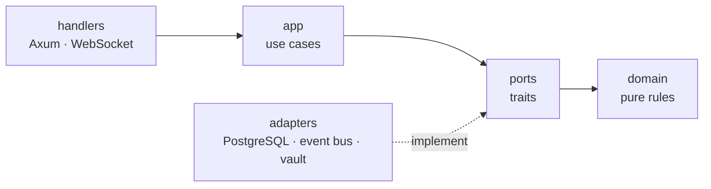
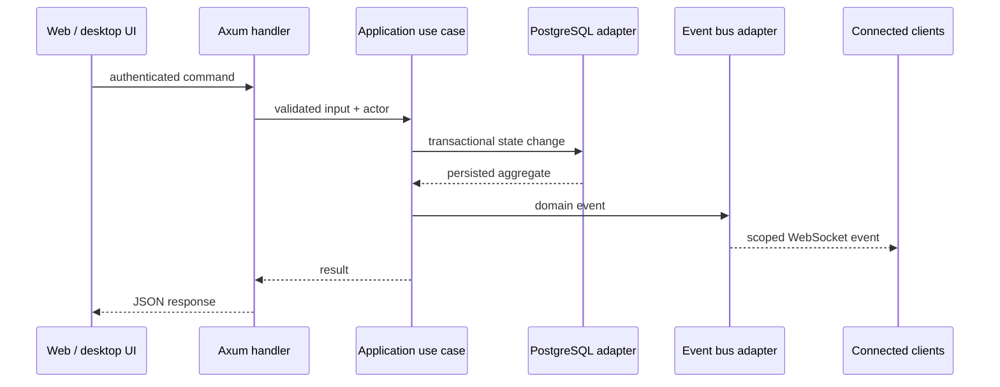

# Architecture

OpsWarden is a modular hexagonal monolith. Business rules stay in one Rust
process; web and desktop clients consume the same HTTP and WebSocket contracts.
The cloud showcase remains in the separate `opswarden-ops` repository.

## Dependency rule



Everything points inward. The domain does not import Axum, SQLx, PostgreSQL or
network concepts.

| Layer      | Owns                                              | Must not own              |
| ---------- | ------------------------------------------------- | ------------------------- |
| `domain`   | models, transitions, invariants, stable errors    | transport or persistence  |
| `ports`    | interfaces required by use cases                  | SQL or HTTP details       |
| `app`      | authorization-aware orchestration                 | Axum responses or queries |
| `adapters` | PostgreSQL, broadcasting, encryption              | new business policy       |
| `handlers` | parsing, authentication context, response mapping | duplicated invariants     |
| clients    | interaction state and presentation                | server-side authority     |

## Request and event flow



The database change is authoritative. WebSocket events make clients converge;
they do not replace persistence or authorization.

## Repository map

```text
opswarden/
├── server/               # Rust/Axum server and all authoritative business rules
│   ├── src/
│   │   ├── domain/       # pure models and invariants; zero I/O
│   │   ├── ports/        # traits required by application use cases
│   │   ├── app/          # authorization-aware business orchestration
│   │   ├── adapters/     # PostgreSQL, event bus and encrypted vault
│   │   ├── handlers/     # Axum routes and WebSocket transport
│   │   ├── config.rs
│   │   └── lib.rs        # build_app(), testable without opening a socket
│   ├── migrations/       # executable PostgreSQL schema history
│   ├── tests/            # integration tests
│   └── Dockerfile        # multi-stage server image
├── client-web/           # Next.js interface and shared client behavior
├── client-desktop/       # Tauri URL-mode shell, tray and notifications
├── contracts/            # cross-client capabilities
├── docs/                 # source for this technical portal
├── .github/workflows/    # CI, documentation and release pipelines
├── docker-compose.yml    # db, server, desktop packager and web delivery
├── Cargo.toml            # Cargo workspace
└── package.json          # npm workspaces
```

## Why these boundaries

- **Rust, Axum and Tokio** keep lifecycle transitions typed while supporting
  concurrent HTTP and WebSocket clients.
- **PostgreSQL** supplies transactions, foreign keys and concurrent writes for
  team-scoped operational state.
- **Tauri** reuses the production web client and adds a small native shell,
  instead of creating a second product implementation.

These choices matter less than the boundary: a transport or storage change
must not require incident policy to be rewritten.
