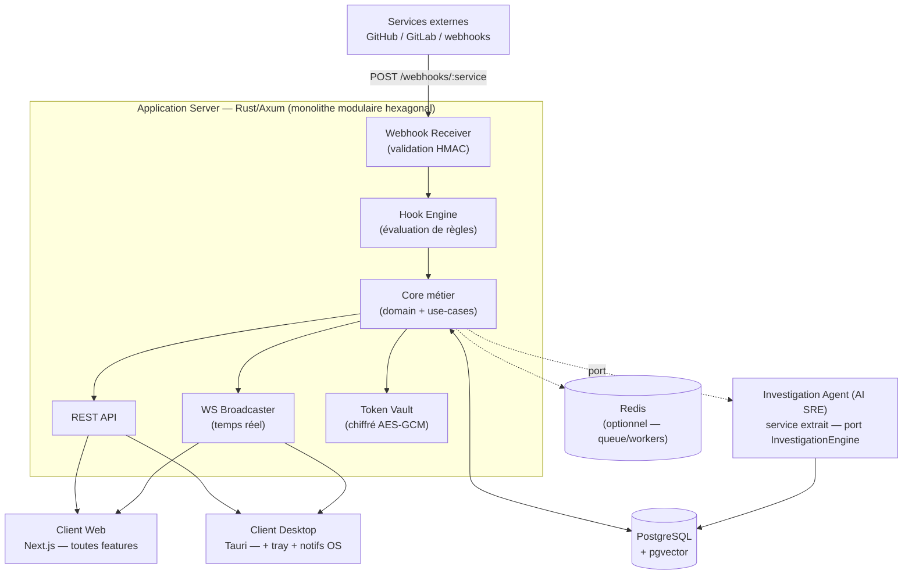
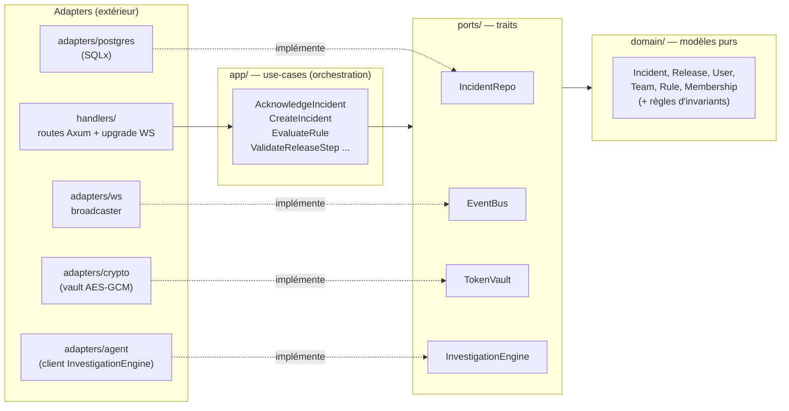
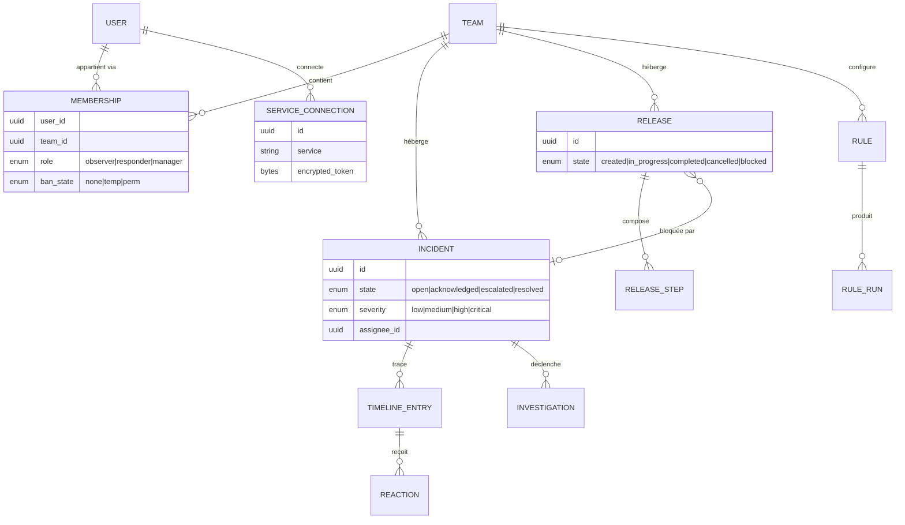
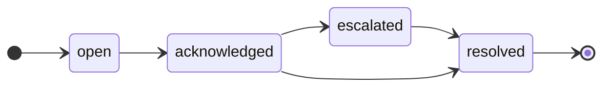
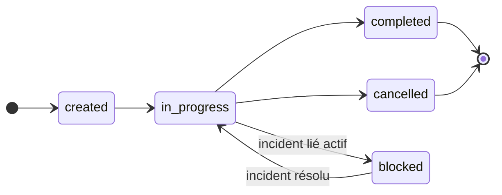
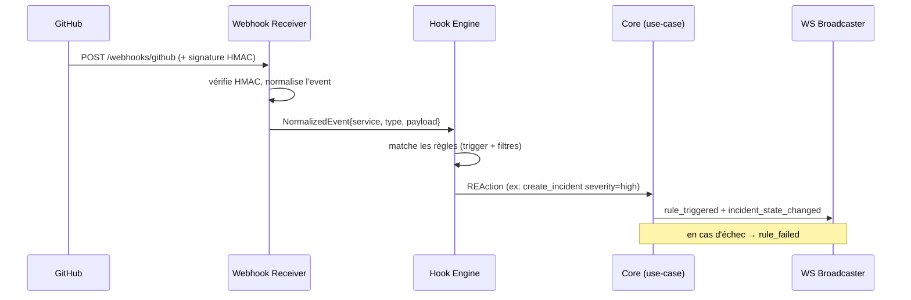
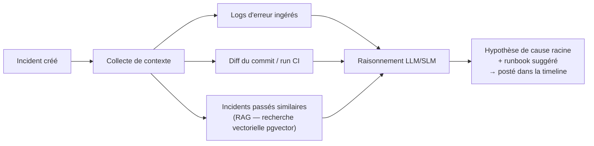
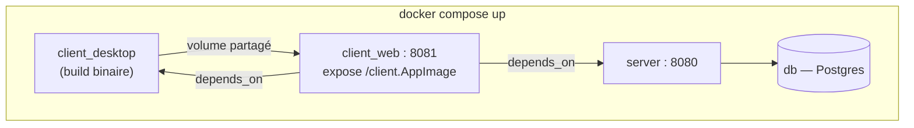

# OpsWarden — Blueprint produit & technique

> Document de design (le « quoi » et le « comment »). Compagnon de la roadmap (le « quand »).
> Décisions verrouillées : monorepo modulaire (cargo + npm workspaces), hexagonal Rust/Axum, agent RAG = service unique extrait derrière un port, couche cloud en repo `opswarden-ops` séparé hors notation.

---

## 1. Identité produit

**OpsWarden est une plateforme collaborative de gestion d'incidents, temps réel, avec un moteur d'automatisation Action→REAction et un agent d'investigation (AI SRE).**

Une équipe technique y coordonne en direct ses **Incidents** (problèmes non planifiés, triés et résolus) et ses **Releases** (déploiements planifiés, validés étape par étape). Les deux sont liés : un Incident peut bloquer une Release en cours. Des événements externes (CI qui casse, webhook) déclenchent automatiquement des actions internes, et un agent lit le contexte (logs, diff de commit, incidents passés) pour proposer une cause racine.

**Positionnement** : un mini incident.io / Rootly, avec un agent d'investigation — la brique frontière 2026 du marché. Pas un clone de chat scolaire : un outil réellement utilisable, publiable.

**Valeur cœur** : réduire la « coordination tax » et le MTTR — moins de bascule entre dashboards, comm centralisée, apprentissage de chaque incident.

**Cibles** : équipes dev / SRE / plateforme.

### Lecture marché 2026

Les leaders du marché (PagerDuty, incident.io, Rootly, FireHydrant, Datadog Incident Management) convergent sur les mêmes briques : ingestion de signaux, orchestration d'incidents, collaboration temps réel, automatisation, et de plus en plus **investigation assistée par IA**.

Ce que VIGIL demande couvre déjà le socle crédible : lifecycle, timeline, rôles, temps réel, webhooks, automatisation. Ce qui différencie OpsWarden n'est donc pas d'ajouter dix sous-systèmes "enterprise", mais de bien exécuter ce socle et d'y brancher une brique **AI SRE** réaliste.

Conséquence produit : OpsWarden se positionne comme un **mini incident.io / Rootly** publiable, centré sur la réduction du MTTR, plutôt qu'un simple chat temps réel re-skinné.

---

## 2. Périmètre fonctionnel (carte des features)

Organisé par briques d'une vraie IMP. `[core]` = bloquant pour la notation, `[ext]` = grade-boosting, `[cherry]` = portfolio.

| Brique | Features | Statut |
|---|---|---|
| **Auth & identité** | signup email/pwd, login JWT, `/me`, logout (invalidation token) | `[core]` |
| | OAuth2 GitHub | `[ext]` |
| **Teams & RBAC** | teams, code d'invitation, 3 rôles (Observer/Responder/Manager), transfert Manager | `[core]` |
| | modération (kick / ban temp / ban perm) | `[ext]` |
| **Incident lifecycle** | états open→ack→escalated→resolved, sévérité low→critical, assignation | `[core]` |
| **Collaboration temps réel** | timeline horodatée, présence (qui regarde quoi), reconnexion auto | `[core]` |
| | édition d'entrée, réactions emoji, messages privés 1-1 | `[ext]` |
| **Automatisation (Action→REAction)** | webhook receiver + HMAC, hook engine, ≥1 règle end-to-end, `/about.json` dynamique + token | `[core]` |
| | services additionnels (GitLab, HTTP, Email, Timer, Generic Webhook) | `[ext]` |
| **Releases** | cycle created→in_progress→completed/cancelled, steps séquentiels, **blocage auto** par incident lié | `[ext]` |
| **AI SRE / investigation** | agent RAG, `@ask` / `@search`, hypothèse de cause racine + runbook dans la timeline | `[cherry]` |
| **Clients** | web (Next.js) + desktop natif (Tauri) avec notifs OS + tray | `[core]` |
| **i18n** | FR/EN (labels, états, sévérités), persisté serveur | `[core/ext]*` |
| **Vitrine cloud** | k8s / terraform / Traefik / OTel | `[cherry]` |

*\*core ou ext selon ton exemption T-DEV-600.*

---

## 3. Architecture système (vue macro)



Points clés :
- **Aucune logique métier dans les clients.** Ils affichent et relaient (REST + WS).
- L'agent est **isolé derrière un port** : si l'agent tombe, les incidents fonctionnent quand même (dégradation gracieuse → `rule_failed`).
- **pgvector dans Postgres** pour le RAG = pas d'infra vectorielle supplémentaire (quickwin). Redis/workers = nice-to-have pour l'asynchrone.

---

## 4. Architecture hexagonale (vue interne serveur)

Règle de dépendance : **tout pointe vers l'intérieur.** Le domaine ne connaît ni Axum, ni SQLx, ni le réseau.



**Bénéfice testabilité** : on teste les use-cases et le domaine **sans DB ni HTTP** (ports mockés). C'est exactement ce que le jury récompense (`code_maintainability`, separation of concerns) et ce qui te donne tes 70% de couverture sans douleur.

Ports principaux (traits) :
- `IncidentRepo`, `ReleaseRepo`, `TeamRepo`, `UserRepo` — persistance
- `EventBus` — diffusion temps réel
- `TokenVault` — chiffrement/déchiffrement des tokens tiers
- `RuleEngine` / `WebhookVerifier` — automatisation
- `InvestigationEngine` — l'agent AI SRE
- `Clock`, `IdGen` — pour des tests déterministes

---

## 5. Modèle de domaine



### Machines à états





Invariants portés par le domaine (testés) : un seul Manager par Team ; le Manager ne quitte pas sans transférer ; un step de Release ne se valide qu'après le précédent ; l'historique (timeline, ack, validations) reste attribué même après kick/ban.

---

## 6. Moteur Action → REAction

Flux : événement externe normalisé → règle évaluée → réaction exécutée.



Forme d'une règle (déclarative, persistée) :
```json
{
  "name": "CI failure → Incident",
  "enabled": true,
  "trigger": { "service": "github", "event": "workflow_run",
               "filters": { "conclusion": "failure", "repository": "org/repo" } },
  "reaction": { "type": "opswarden_create_incident",
                "payload": { "title": "CI cassée sur {{repository.name}}", "severity": "high" } }
}
```

**Extensibilité** (c'est le sujet de `HOWTOCONTRIBUTE.md`) : ajouter un service = implémenter `Action` (parsing d'event) et/ou `REAction` (exécution) derrière les traits existants, puis le déclarer dans `/about.json`. Les clients ne hardcodent jamais un service : ils lisent `/about.json`.

Services au lancement : **Action** = GitHub (`workflow_run: failure`) ; **REAction** = OpsWarden (`create_incident`) + Slack. Le reste (GitLab, HTTP, Email, Timer) = extension par le même mécanisme.

---

## 7. Agent AI SRE (le différenciateur)

Service unique extrait, branché via le port `InvestigationEngine`. Tout le reste de la plateforme l'ignore (il pourrait être supprimé sans casser le core).



- **Endpoints** : `@ask` (question libre sur un incident/contexte), `@search` (recherche sémantique dans l'historique).
- **RAG store** : embeddings dans **pgvector** (réutilise Postgres, zéro infra en plus). Async via Redis/workers = nice-to-have.
- **Implémentation** : service dédié (FastAPI ou crate Rust). Contrat d'interface stable (le core appelle un port, pas l'implémentation).
- **Dégradation gracieuse** : agent indisponible → l'incident vit sa vie, on émet `rule_failed`, aucune feature core impactée.
- **Pourquoi ça compte** : c'est exactement la direction du marché 2026 (« AI SRE » : relier télémétrie + changements de code + incidents passés pour faire remonter la cause racine). À ton échelle, c'est une version réduite mais crédible.

---

## 8. Temps réel (WebSocket)

- **Une connexion WS par client.** Le broadcaster est un adapter (`EventBus`).
- **Ciblage** : la plupart des events sont diffusés aux membres connectés de la Team concernée ; `private_message_received` uniquement émetteur + destinataire ; présence par ressource.
- **Reconnexion auto** côté client obligatoire (resync de l'état).

Taxonomie (détaillée dans `WEBSOCKET_SPEC.md`) :

| Catégorie | Events |
|---|---|
| Incident `[core]` | `incident_state_changed`, `incident_escalated`, `incident_assigned`, `timeline_entry_added`, `presence_update` |
| Automatisation `[core]` | `rule_triggered`, `rule_failed` |
| Release `[ext]` | `release_step_validated`, `release_state_changed` |
| Modération `[ext]` | `member_kicked`, `member_banned` (`until=null` si permanent) |
| Collaboration `[ext]` | `timeline_entry_edited`, `private_message_received`, `reaction_added`, `reaction_removed` |

---

## 9. Surface API REST (résumé)

| Domaine | Endpoints clés |
|---|---|
| Auth | `POST /auth/signup`, `POST /auth/login`, `POST /auth/logout`, `GET /me` |
| Teams | `POST /teams`, `POST /teams/:id/join`, `PUT /teams/:id/members/:uid`, transfert Manager |
| Incidents | `POST /incidents`, transitions d'état, `POST /incidents/:id/assign` |
| Timeline | `POST /incidents/:id/timeline`, `GET /incidents/:id/timeline` |
| Releases `[ext]` | `POST /releases`, `POST /releases/:id/steps/:s/validate` |
| Rules | `POST /rules`, `GET /rules`, `POST /webhooks/:service` |
| Services | connexion tiers (token → vault), `GET /reactions/available` |
| Système | `GET /about.json` (catalogue + token SHA-256), `GET /health` |

Toutes les routes protégées renvoient 401/403/404 cohérents.

---

## 10. Stack technique & justifications

| Composant | Choix | Justification (1 ligne, défendable au jury) |
|---|---|---|
| Serveur | **Rust + Axum + Tokio** | typage fort + enums d'erreur = robustesse ; maîtrise existante de l'hexagonal en Rust |
| Persistance | **PostgreSQL + SQLx** | concurrence multi-connexion temps réel + migrations + pgvector pour le RAG |
| Temps réel | **WebSockets** | exigé ; un broadcaster en adapter |
| Client web | **Next.js + Tailwind** | exigé ; i18n via next-intl |
| Client desktop | **Tauri** | binaire léger (AppImage), recommandé avec backend Rust, notifs OS natives propres |
| Conteneurs | **Docker Compose** | exigé ; contrat de notation |
| CI/CD | **GitHub Actions** | exigé ; lint+test+coverage+release par tag |
| Agent | **service extrait (pgvector)** | isolé par port, dégradation gracieuse, zéro infra vectorielle en plus |
| Cloud (vitrine) | **opswarden-ops séparé** | hors notation ; ne casse jamais la démo |

### Arbitrages d'architecture

- **Monolithe modulaire d'abord, pas microservices complets** : en solo sur 12 semaines, la priorité est la fiabilité de démo et la vitesse de livraison. Les frontières fortes vivent dans les modules et les ports, sans taxe opérationnelle distribuée prématurée.
- **Un seul service extrait pour l'IA** : l'agent d'investigation mérite une isolation technique et contractuelle, mais pas une constellation de services. `InvestigationEngine` est le seul candidat naturel à l'extraction précoce.
- **Cloud séparé du produit** : l'infra vitrine (`opswarden-ops`) sert le portfolio et l'apprentissage, jamais le chemin critique du jury. `docker compose up` reste la source de vérité exécutable.

---

## 11. Topologie de déploiement

### Contrat jury — `docker-compose.yml` (racine)



- `client_web` dépend de `server` **ET** `client_desktop`.
- Binaire desktop téléchargeable : `GET http://localhost:8081/client.AppImage` (cible Linux, documentée README).

### Vitrine — repo `opswarden-ops` (hors notation)
`terraform/` (DOKS) · `k8s/` (Traefik, Postgres, Redis, ingress, cAdvisor) · `bootstrap/` (Minikube) · OTel/Grafana/Loki. **Jamais un prérequis pour faire tourner OpsWarden.**

---

## 12. Layout du monorepo

```
opswarden/
├── docker-compose.yml          # contrat jury
├── Cargo.toml                  # cargo workspace
├── package.json                # npm workspaces
├── server/                     # crate Axum (hexagonal)
│   ├── domain/  ports/  app/  adapters/  handlers/
│   └── migrations/
├── investigation/              # agent AI SRE (service extrait)
├── client-web/                 # Next.js + Tailwind + i18n
├── client-desktop/             # Tauri (réutilise le front)
└── docs/                       # README, WEBSOCKET_SPEC, HOWTOCONTRIBUTE, UI_GUIDELINES
```

---

## 13. Principes transverses (NFR)

- **Sécurité** : tokens tiers chiffrés (AES-GCM) en vault, jamais en clair ; HMAC sur webhooks ; JWT avec invalidation au logout ; RBAC appliqué **côté serveur** uniquement.
- **Séparation** : zéro logique métier dans les clients ; dépendances pointent vers le domaine.
- **Pas de dark patterns** : confirmations destructives nommant la ressource ; pas d'inversion de confirmation ; rien de caché.
- **Accessibilité** (`UI_GUIDELINES.md`) : navigation clavier sur actions primaires ; labels explicites ; couleur jamais seule (couleur + icône + texte pour états/sévérités).
- **Tests** : ≥ 70% lignes + branches au-delà du happy path ; rapport en artifact CI.
- **Observabilité** : OTel/Grafana en vitrine, optionnel.

---

*Blueprint v1 — vit en parallèle de la roadmap. Mis à jour si une décision d'archi change.*
