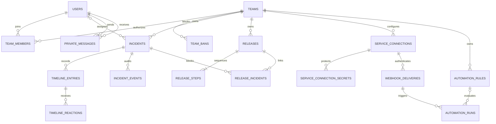

# Data model

The versioned migrations in `server/migrations/` are the executable source of
truth. This view explains the relations a contributor needs before changing a
use case.

## Invariants worth protecting

- A partial unique index permits exactly one Manager per Team.
- Kicks and bans do not rewrite historical authors or actors.
- Release steps remain ordered; linked active incidents derive the blocked state.
- Connection secrets are encrypted separately from displayable metadata.
- Webhook delivery identifiers and automation runs preserve idempotency and audit history.
- Revoked JWT identifiers persist logout invalidation.

When a migration changes one of these rules, update the domain invariant, its
integration tests and this page in the same pull request.
